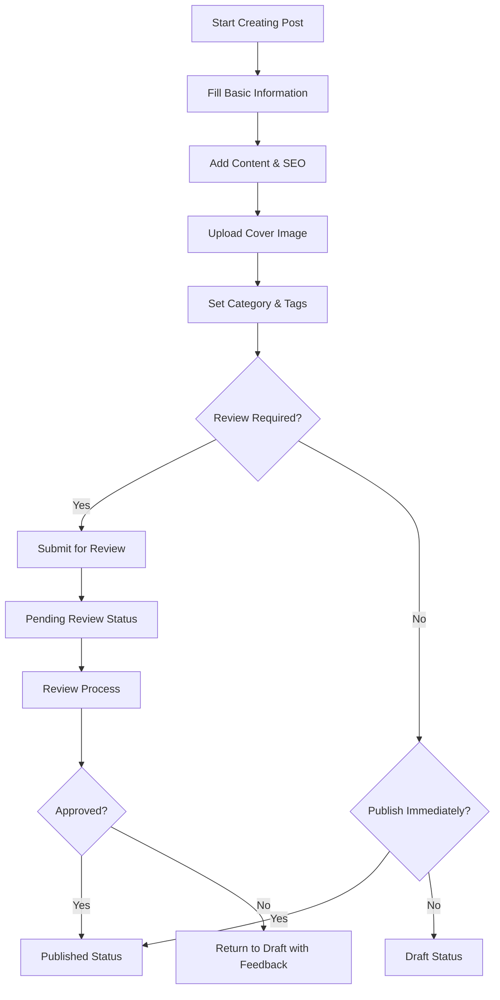

# Professional Post Management System - Complete Documentation

## Table of Contents
1. [System Overview](#system-overview)
2. [Architecture & Technical Stack](#architecture--technical-stack)
3. [Core Features](#core-features)
4. [User Interface Components](#user-interface-components)
5. [Data Models & Schema](#data-models--schema)
6. [API Integration](#api-integration)
7. [Workflow & Business Logic](#workflow--business-logic)
8. [Security & Validation](#security--validation)
9. [Performance Optimization](#performance-optimization)
10. [Deployment Guide](#deployment-guide)
11. [Customization Options](#customization-options)
12. [Testing Strategy](#testing-strategy)
13. [Maintenance & Monitoring](#maintenance--monitoring)
14. [Future Enhancements](#future-enhancements)

---

## System Overview

The Professional Post Management System is a comprehensive content management solution designed specifically for accounting firms to manage their blog posts, articles, and professional content. The system combines modern web technologies with business-focused features to create a complete solution for professional content operations.

### Key Objectives

- **Professional Content Management**: Handle accounting-specific content with compliance tracking
- **Workflow Management**: Support review and approval processes for financial content
- **SEO Optimization**: Built-in search engine optimization tools
- **Performance Tracking**: Monitor content engagement and effectiveness
- **Compliance Monitoring**: Ensure regulatory compliance for financial content

### Target Users

- **Content Managers**: Create and manage blog content
- **Senior Partners**: Review and approve content before publication
- **Marketing Teams**: Track performance and optimize content strategy
- **Compliance Officers**: Monitor regulatory compliance

---

## Architecture & Technical Stack

### Frontend Technology Stack

```typescript
// Core Framework
React 18+ with TypeScript
Next.js 14 App Router (if integrated)

// UI Components
- Tailwind CSS for styling
- Radix UI primitives (via shadcn/ui)
- Lucide React icons

// State Management
- React hooks (useState, useEffect, useMemo, useCallback)
- Local state management with validation

// Form Handling
- Custom validation with real-time feedback
- File upload with validation
- Auto-save capabilities
```

### Component Architecture

```
ProfessionalPostManagement/
├── Core State Management
│   ├── posts: Post[]
│   ├── loading/saving states
│   ├── form data management
│   └── validation error handling
├── UI Components
│   ├── Statistics Dashboard
│   ├── Advanced Filters
│   ├── Post Grid/Cards
│   └── Modal Dialogs
├── Business Logic
│   ├── Filtering & Sorting
│   ├── Form Validation
│   ├── Image Handling
│   └── API Integration
└── Utilities
    ├── Data Transformation
    ├── Validation Functions
    └── Helper Methods
```

---

## Core Features

### 1. Advanced Content Management

#### Post Creation & Editing
- **Rich Content Editor**: Full-featured text editor with markdown support
- **Real-time Validation**: Form validation with immediate feedback
- **Auto-generated Slugs**: URL-friendly slugs generated from titles
- **Word Count Tracking**: Real-time word count and reading time estimation
- **Version Control**: Track post versions and modifications

#### Content Organization
- **Categories**: Predefined accounting-specific categories
  - Tax Planning
  - Financial Planning
  - Compliance
  - Business Strategy
  - Industry News
  - Tax Law
  - Audit & Assurance
  - Payroll Services
  - Business Formation

- **Tag System**: Flexible tagging for cross-category organization
- **Priority Levels**: Four-tier priority system (Low, Medium, High, Urgent)
- **Featured Content**: Highlight important posts

### 2. Professional Workflow Management

#### Review & Approval Process
```typescript
interface ReviewWorkflow {
  reviewRequired: boolean     // Requires approval before publishing
  approvedBy?: string        // Who approved the content
  reviewComments?: string[]  // Review feedback
  complianceChecked: boolean // Compliance verification
}
```

#### Status Management
- **Draft**: Work-in-progress content
- **Published**: Live content visible to public
- **Scheduled**: Content scheduled for future publication
- **Archived**: Removed from active use but preserved

### 3. Compliance & Quality Control

#### Compliance Tracking
- **Regulatory Compliance**: Track compliance with financial regulations
- **Content Review**: Mandatory review for sensitive financial content
- **Approval Workflow**: Multi-level approval for critical content
- **Audit Trail**: Complete history of changes and approvals

#### Quality Metrics
- **SEO Optimization**: Built-in SEO best practices
- **Readability Scores**: Content readability assessment
- **Professional Standards**: Ensure content meets firm standards

### 4. Performance Analytics

#### Engagement Metrics
```typescript
interface PostMetrics {
  views: number              // Total page views
  shares: number             // Social media shares
  comments: number           // User comments
  readTime: number          // Average reading time
  bounceRate?: number       // Visitor engagement
  conversionRate?: number   // Lead generation effectiveness
}
```

#### Business Intelligence
- **Content Performance**: Track most effective content
- **Author Analytics**: Performance by content creator
- **Category Analysis**: Most engaging content categories
- **SEO Performance**: Search engine ranking tracking

---

## User Interface Components

### 1. Dashboard Statistics

The dashboard provides a comprehensive overview of content performance with five key metric cards:

```typescript
interface DashboardStats {
  published: number         // Total published posts
  drafts: number           // Posts in draft status
  featured: number         // Featured content count
  totalViews: number       // Aggregate view count
  needsReview: number      // Posts requiring review
}
```

**Visual Features:**
- Gradient background cards for visual appeal
- Color-coded metrics (green for success, yellow for attention, red for urgent)
- Real-time updates
- Click-through navigation to filtered views

### 2. Advanced Filtering System

#### Filter Categories
- **Search**: Full-text search across title, content, tags, and author
- **Status**: Draft, Published, Scheduled, Archived
- **Category**: Accounting-specific content categories
- **Priority**: Low, Medium, High, Urgent
- **Compliance**: Compliant, Non-compliant, All
- **Author**: Filter by content creator

#### Sorting Options
- Last Modified (default)
- Published Date
- View Count
- Title (alphabetical)
- Ascending/Descending order

### 3. Post Card Design

Each post is displayed in a comprehensive card format:

```typescript
interface PostCard {
  // Visual Elements
  coverImage?: string       // Professional cover image
  statusBadge: StatusBadge  // Color-coded status
  priorityIndicator: Badge  // Priority level
  complianceIcon: Icon     // Compliance status
  
  // Content Summary
  title: string
  excerpt?: string
  category: string
  tags: string[]
  
  // Metadata
  author: AuthorInfo
  lastModified: Date
  wordCount: number
  readTime: number
  
  // Performance Metrics
  views: number
  shares: number
  
  // Actions
  editButton: Action
  deleteButton: Action
  previewButton: Action
  viewLiveButton: Action
}
```

### 4. Modal Dialogs

#### Create/Edit Modal
- **Two-column Layout**: Content editor and metadata sidebar
- **Live Validation**: Real-time form validation
- **Image Upload**: Drag-and-drop cover image upload
- **SEO Tools**: Meta title and description optimization
- **Publishing Options**: Status, featured, review requirements

#### Preview Modal
- **Full Content Preview**: See exactly how content will appear
- **Responsive Preview**: Mobile and desktop views
- **SEO Preview**: How content appears in search results

---

## Data Models & Schema

### Core Post Model

```typescript
interface Post {
  // Basic Information
  id: string
  title: string
  slug: string                // URL-friendly identifier
  content: string             // Main post content
  excerpt?: string           // Brief description
  
  // Publishing
  published: boolean
  featured: boolean
  status: PostStatus         // draft | published | scheduled | archived
  publishedAt?: Date
  scheduledAt?: Date
  
  // Organization
  category: string
  tags: string[]
  priority: PostPriority     // low | medium | high | urgent
  
  // SEO
  seoTitle?: string         // Optimized title for search engines
  seoDescription?: string   // Meta description
  coverImage?: string       // Featured image URL
  
  // Workflow
  reviewRequired: boolean
  approvedBy?: string
  isCompliant: boolean
  
  // Metadata
  author: AuthorInfo
  version: number           // Version tracking
  wordCount: number        // Calculated word count
  readTime: number         // Estimated reading time
  lastModified: Date
  
  // Analytics
  views: number
  shares: number
  comments: number
}

interface AuthorInfo {
  id: string
  name: string
  avatar?: string
  role: string             // Senior Tax Advisor, Managing Partner, etc.
}

type PostStatus = 'draft' | 'published' | 'scheduled' | 'archived'
type PostPriority = 'low' | 'medium' | 'high' | 'urgent'
```

### Form Data Model

```typescript
interface PostFormData {
  title: string
  slug: string
  excerpt: string
  content: string
  tags: string              // Comma-separated string
  featured: boolean
  published: boolean
  coverImage?: File
  seoTitle: string
  seoDescription: string
  category: string
  priority: PostPriority
  reviewRequired: boolean
  publishedAt?: string
  scheduledAt?: string
}
```

### Validation Schema

```typescript
interface ValidationError {
  field: string
  message: string
}

// Validation Rules
const validationRules = {
  title: {
    required: true,
    maxLength: 100,
    minLength: 5
  },
  slug: {
    required: true,
    pattern: /^[a-z0-9-]+$/,
    unique: true
  },
  content: {
    required: true,
    minLength: 100,
    maxLength: 50000
  },
  seoTitle: {
    maxLength: 60,
    recommended: "50-60 characters for optimal display"
  },
  seoDescription: {
    maxLength: 160,
    recommended: "150-160 characters for optimal display"
  },
  coverImage: {
    maxSize: 5 * 1024 * 1024, // 5MB
    allowedTypes: ['image/jpeg', 'image/png', 'image/webp']
  }
}
```

---

## API Integration

### Required API Endpoints

```typescript
interface PostAPI {
  // CRUD Operations
  getPosts(params?: GetPostsParams): Promise<PostsResponse>
  createPost(data: CreatePostRequest): Promise<PostResponse>
  updatePost(id: string, data: UpdatePostRequest): Promise<PostResponse>
  deletePost(id: string): Promise<DeleteResponse>
  
  // Specialized Operations
  getPost(slug: string): Promise<PostResponse>
  publishPost(id: string): Promise<PublishResponse>
  schedulePost(id: string, date: Date): Promise<ScheduleResponse>
  archivePost(id: string): Promise<ArchiveResponse>
  
  // Analytics
  getPostAnalytics(id: string): Promise<AnalyticsResponse>
  getBulkAnalytics(ids: string[]): Promise<BulkAnalyticsResponse>
  
  // Media
  uploadImage(file: File): Promise<ImageUploadResponse>
  deleteImage(url: string): Promise<DeleteResponse>
}
```

### Request/Response Models

```typescript
interface GetPostsParams {
  limit?: number
  offset?: number
  status?: PostStatus
  category?: string
  priority?: PostPriority
  author?: string
  search?: string
  sortBy?: 'lastModified' | 'publishedAt' | 'views' | 'title'
  sortOrder?: 'asc' | 'desc'
}

interface PostsResponse {
  posts: Post[]
  total: number
  hasMore: boolean
}

interface CreatePostRequest {
  title: string
  slug: string
  content: string
  excerpt?: string
  category: string
  tags: string[]
  priority: PostPriority
  featured: boolean
  published: boolean
  reviewRequired: boolean
  seoTitle?: string
  seoDescription?: string
  coverImage?: string
}
```

### Error Handling

```typescript
interface APIError {
  code: string
  message: string
  field?: string           // For validation errors
  details?: any
}

// Common Error Codes
enum ErrorCodes {
  VALIDATION_ERROR = 'VALIDATION_ERROR',
  DUPLICATE_SLUG = 'DUPLICATE_SLUG',
  UNAUTHORIZED = 'UNAUTHORIZED',
  NOT_FOUND = 'NOT_FOUND',
  RATE_LIMITED = 'RATE_LIMITED',
  SERVER_ERROR = 'SERVER_ERROR'
}
```

---

## Workflow & Business Logic

### Content Creation Workflow



### Review & Approval Process

```typescript
interface ReviewProcess {
  // Review Requirements
  contentReview: boolean    // Editorial review
  complianceReview: boolean // Regulatory compliance
  factCheck: boolean        // Accuracy verification
  seoReview: boolean        // Search optimization
  
  // Review Roles
  reviewers: {
    contentEditor?: string
    complianceOfficer?: string
    seniorPartner?: string
  }
  
  // Review Status
  status: 'pending' | 'approved' | 'rejected' | 'needs_revision'
  comments: ReviewComment[]
  approvedAt?: Date
  approvedBy?: string
}

interface ReviewComment {
  reviewer: string
  comment: string
  type: 'suggestion' | 'required_change' | 'approval'
  timestamp: Date
}
```

### Publishing Logic

```typescript
const publishingLogic = {
  // Immediate Publishing
  publishNow: (post: Post) => {
    validatePost(post)
    checkCompliance(post)
    updateSearchIndex(post)
    notifySubscribers(post)
    logAnalytics('post_published', post.id)
  },
  
  // Scheduled Publishing
  schedulePost: (post: Post, publishDate: Date) => {
    validatePost(post)
    setScheduledStatus(post, publishDate)
    createPublishingJob(post.id, publishDate)
  },
  
  // Draft Saving
  saveDraft: (post: Post) => {
    autoSave(post)
    logActivity('draft_saved', post.id)
  }
}
```

---

## Security & Validation

### Input Validation

```typescript
class PostValidator {
  static validateTitle(title: string): ValidationError[] {
    const errors: ValidationError[] = []
    
    if (!title.trim()) {
      errors.push({ field: 'title', message: 'Title is required' })
    }
    
    if (title.length > 100) {
      errors.push({ field: 'title', message: 'Title must be less than 100 characters' })
    }
    
    if (title.length < 5) {
      errors.push({ field: 'title', message: 'Title must be at least 5 characters' })
    }
    
    return errors
  }
  
  static validateSlug(slug: string, existingSlugs: string[]): ValidationError[] {
    const errors: ValidationError[] = []
    
    if (!slug.trim()) {
      errors.push({ field: 'slug', message: 'URL slug is required' })
    }
    
    if (!/^[a-z0-9-]+$/.test(slug)) {
      errors.push({ 
        field: 'slug', 
        message: 'Slug can only contain lowercase letters, numbers, and hyphens' 
      })
    }
    
    if (existingSlugs.includes(slug)) {
      errors.push({ field: 'slug', message: 'This URL slug is already in use' })
    }
    
    return errors
  }
  
  static validateContent(content: string): ValidationError[] {
    const errors: ValidationError[] = []
    
    if (!content.trim()) {
      errors.push({ field: 'content', message: 'Content is required' })
    }
    
    if (content.length < 100) {
      errors.push({ 
        field: 'content', 
        message: 'Content should be at least 100 characters for meaningful posts' 
      })
    }
    
    return errors
  }
}
```

### File Upload Security

```typescript
class ImageValidator {
  static readonly MAX_FILE_SIZE = 5 * 1024 * 1024 // 5MB
  static readonly ALLOWED_TYPES = ['image/jpeg', 'image/png', 'image/webp']
  
  static validateImage(file: File): ValidationError[] {
    const errors: ValidationError[] = []
    
    if (!this.ALLOWED_TYPES.includes(file.type)) {
      errors.push({
        field: 'coverImage',
        message: 'Please select a valid image file (JPEG, PNG, or WebP)'
      })
    }
    
    if (file.size > this.MAX_FILE_SIZE) {
      errors.push({
        field: 'coverImage',
        message: 'Image file size must be less than 5MB'
      })
    }
    
    return errors
  }
}
```

### Content Security

```typescript
interface SecurityConfig {
  // Content Sanitization
  allowedTags: string[]
  stripScripts: boolean
  validateUrls: boolean
  
  // Access Control
  roles: {
    create: ['content_manager', 'editor', 'admin']
    edit: ['content_manager', 'editor', 'admin', 'author']
    delete: ['admin', 'content_manager']
    publish: ['editor', 'admin']
    approve: ['senior_partner', 'compliance_officer']
  }
  
  // Rate Limiting
  maxRequestsPerMinute: 60
  maxUploadsPerHour: 10
}
```

---

## Performance Optimization

### Frontend Optimization

```typescript
// React Performance Optimizations
const PostManagement = () => {
  // Memoized expensive calculations
  const filteredPosts = useMemo(() => {
    return applyFilters(posts, filters)
  }, [posts, filters])
  
  // Callback optimization
  const handlePostUpdate = useCallback((id: string, data: PostFormData) => {
    updatePost(id, data)
  }, [])
  
  // Debounced search
  const debouncedSearch = useDebounce(searchQuery, 300)
  
  // Virtualization for large lists (if needed)
  const virtualizedPosts = useVirtual({
    size: filteredPosts.length,
    parentRef: containerRef,
    estimateSize: useCallback(() => 350, [])
  })
}

// Image Optimization
const optimizeImage = async (file: File): Promise<File> => {
  const canvas = document.createElement('canvas')
  const ctx = canvas.getContext('2d')
  const img = new Image()
  
  return new Promise((resolve) => {
    img.onload = () => {
      // Resize to optimal dimensions
      const maxWidth = 1200
      const maxHeight = 600
      const ratio = Math.min(maxWidth / img.width, maxHeight / img.height)
      
      canvas.width = img.width * ratio
      canvas.height = img.height * ratio
      
      ctx?.drawImage(img, 0, 0, canvas.width, canvas.height)
      
      canvas.toBlob((blob) => {
        resolve(new File([blob!], file.name, { type: 'image/webp' }))
      }, 'image/webp', 0.8)
    }
    
    img.src = URL.createObjectURL(file)
  })
}
```

### Data Management

```typescript
// Pagination Strategy
interface PaginationConfig {
  pageSize: number          // Default: 12 posts per page
  prefetchPages: number     // Pre-load next 2 pages
  cacheSize: number         // Keep 5 pages in memory
  lazyLoadImages: boolean   // Load images as they enter viewport
}

// Caching Strategy
interface CacheConfig {
  posts: {
    ttl: number            // 5 minutes for post list
    maxSize: number        // Maximum cached posts
    strategy: 'LRU'        // Least Recently Used eviction
  }
  images: {
    ttl: number            // 1 hour for images
    maxSize: number        // Maximum cached images
    storage: 'indexedDB'   // Persistent storage
  }
}
```

### Performance Monitoring

```typescript
interface PerformanceMetrics {
  // Load Times
  initialLoad: number       // Time to first render
  filterResponse: number    // Filter application time
  searchResponse: number    // Search response time
  
  // User Interactions
  modalOpenTime: number     // Time to open create/edit modal
  saveTime: number          // Time to save post
  imageUploadTime: number   // Image upload duration
  
  // Memory Usage
  componentMemory: number   // Component memory footprint
  imageMemory: number       // Image cache memory usage
  totalMemory: number       // Total application memory
}
```

---

## Deployment Guide

### Environment Configuration

```bash
# Required Environment Variables
NEXT_PUBLIC_API_BASE_URL=https://api.accountingfirm.com
NEXT_PUBLIC_UPLOAD_ENDPOINT=/api/upload
NEXT_PUBLIC_MAX_FILE_SIZE=5242880  # 5MB in bytes

# Optional Configuration
NEXT_PUBLIC_ANALYTICS_ID=GA-XXXXXXXXX
NEXT_PUBLIC_SENTRY_DSN=https://your-sentry-dsn
NEXT_PUBLIC_ENVIRONMENT=production
```

### Build Configuration

```json
{
  "scripts": {
    "build": "next build",
    "build:analyze": "ANALYZE=true next build",
    "build:prod": "NODE_ENV=production next build",
    "deploy": "npm run build:prod && npm run deploy:vercel"
  },
  "dependencies": {
    "react": "^18.0.0",
    "next": "^14.0.0",
    "typescript": "^5.0.0",
    "@radix-ui/react-dialog": "^1.0.5",
    "lucide-react": "^0.263.1",
    "tailwindcss": "^3.3.0"
  }
}
```

### Deployment Checklist

- [ ] Environment variables configured
- [ ] API endpoints tested
- [ ] Image upload functionality verified
- [ ] Performance monitoring enabled
- [ ] Error tracking configured
- [ ] Security headers implemented
- [ ] CDN configured for images
- [ ] Database migrations applied
- [ ] Backup systems verified
- [ ] SSL certificates installed

### Performance Targets

```typescript
interface PerformanceTargets {
  // Core Web Vitals
  LCP: number    // < 2.5 seconds (Largest Contentful Paint)
  FID: number    // < 100ms (First Input Delay)
  CLS: number    // < 0.1 (Cumulative Layout Shift)
  
  // Custom Metrics
  TTI: number    // < 3.8 seconds (Time to Interactive)
  FCP: number    // < 1.8 seconds (First Contentful Paint)
  
  // Application Metrics
  filterResponseTime: number    // < 200ms
  searchResponseTime: number    // < 300ms
  modalOpenTime: number        // < 100ms
  imageThumbnailLoad: number   // < 500ms
}
```

---

## Customization Options

### Theme Configuration

```typescript
interface ThemeConfig {
  colors: {
    primary: string      // Default: purple-600
    secondary: string    // Default: gray-600
    success: string      // Default: green-600
    warning: string      // Default: yellow-600
    error: string        // Default: red-600
    neutral: string      // Default: gray-500
  }
  
  typography: {
    headingFont: string  // Default: system font stack
    bodyFont: string     // Default: system font stack
    monoFont: string     // Default: ui-monospace
  }
  
  layout: {
    containerMaxWidth: string   // Default: 7xl
    cardBorderRadius: string    // Default: lg
    modalMaxWidth: string       // Default: 6xl
  }
  
  animations: {
    duration: string     // Default: 200ms
    easing: string       // Default: ease-out
    enabled: boolean     // Default: true
  }
}
```

### Business Rule Customization

```typescript
interface BusinessRules {
  // Content Rules
  minWordCount: number         // Minimum words for publication
  maxTagCount: number         // Maximum tags per post
  requireExcerpt: boolean     // Mandate excerpt for all posts
  
  // Workflow Rules
  autoReviewTriggers: {
    complianceKeywords: string[]    // Keywords requiring compliance review
    highPriorityAutoReview: boolean // Auto-review for high priority
    newAuthorReview: boolean        // Review all posts from new authors
  }
  
  // Publishing Rules
  scheduleAdvanceNotice: number   // Hours before scheduled publish
  draftAutoSave: number          // Auto-save interval (seconds)
  maxPendingReviews: number      // Maximum posts awaiting review
  
  // Compliance Rules
  mandatoryTags: string[]        // Required tags for compliance
  prohibitedWords: string[]      // Words requiring special approval
  disclaimerRequired: boolean    // Require legal disclaimers
}
```

### Feature Toggles

```typescript
interface FeatureFlags {
  // Core Features
  enableScheduledPublishing: boolean
  enableBulkOperations: boolean
  enableAdvancedAnalytics: boolean
  enableCollaboration: boolean
  
  // Experimental Features
  enableAIWritingAssist: boolean
  enableAutoTagging: boolean
  enableReadabilityScoring: boolean
  enableSEORecommendations: boolean
  
  // Integration Features
  enableSocialMediaIntegration: boolean
  enableEmailNewsletterSync: boolean
  enableCRMIntegration: boolean
  enableAnalyticsExport: boolean
}
```

---

## Testing Strategy

### Unit Testing

```typescript
// Component Testing
describe('PostCard Component', () => {
  it('displays post information correctly', () => {
    const mockPost = createMockPost()
    render(<PostCard post={mockPost} />)
    
    expect(screen.getByText(mockPost.title)).toBeInTheDocument()
    expect(screen.getByText(mockPost.author.name)).toBeInTheDocument()
    expect(screen.getByText(`${mockPost.readTime}min`)).toBeInTheDocument()
  })
  
  it('shows compliance indicators', () => {
    const nonCompliantPost = createMockPost({ isCompliant: false })
    render(<PostCard post={nonCompliantPost} />)
    
    expect(screen.getByTestId('compliance-warning')).toBeInTheDocument()
  })
  
  it('handles priority indicators correctly', () => {
    const urgentPost = createMockPost({ priority: 'urgent' })
    render(<PostCard post={urgentPost} />)
    
    expect(screen.getByText('Urgent')).toBeInTheDocument()
    expect(screen.getByTestId('priority-indicator')).toHaveClass('bg-red-500')
  })
})

// Validation Testing
describe('Post Validation', () => {
  it('validates required fields', () => {
    const invalidPost = { title: '', content: '', slug: '' }
    const errors = validatePost(invalidPost)
    
    expect(errors).toHaveLength(3)
    expect(errors.map(e => e.field)).toContain('title')
    expect(errors.map(e => e.field)).toContain('content')
    expect(errors.map(e => e.field)).toContain('slug')
  })
  
  it('validates SEO field lengths', () => {
    const postWithLongSEO = {
      seoTitle: 'a'.repeat(70),
      seoDescription: 'b'.repeat(170)
    }
    const errors = validatePost(postWithLongSEO)
    
    expect(errors.some(e => e.field === 'seoTitle')).toBe(true)
    expect(errors.some(e => e.field === 'seoDescription')).toBe(true)
  })
})
```

### Integration Testing

```typescript
// API Integration Testing
describe('Post Management API', () => {
  it('creates post successfully', async () => {
    const postData = createValidPostData()
    const response = await createPost(postData)
    
    expect(response.status).toBe(201)
    expect(response.data.id).toBeDefined()
    expect(response.data.title).toBe(postData.title)
  })
  
  it('handles duplicate slug errors', async () => {
    const postData = createValidPostData()
    await createPost(postData)
    
    const duplicatePost = { ...postData, title: 'Different Title' }
    await expect(createPost(duplicatePost)).rejects.toThrow('Duplicate slug')
  })
  
  it('filters posts correctly', async () => {
    await createMultiplePosts()
    
    const publishedPosts = await getPosts({ status: 'published' })
    const draftPosts = await getPosts({ status: 'draft' })
    
    expect(publishedPosts.data.every(p => p.published)).toBe(true)
    expect(draftPosts.data.every(p => !p.published)).toBe(true)
  })
})
```

### End-to-End Testing

```typescript
// E2E Test Scenarios
describe('Post Management Workflow', () => {
  it('completes full post creation workflow', async () => {
    // Navigate to post management
    await page.goto('/admin/posts')
    
    // Click create post
    await page.click('[data-testid="create-post-button"]')
    
    // Fill form
    await page.fill('[data-testid="title-input"]', 'Test Post Title')
    await page.fill('[data-testid="content-textarea"]', 'Test content'.repeat(20))
    await page.selectOption('[data-testid="category-select"]', 'Tax Planning')
    
    // Upload image
    await page.setInputFiles('[data-testid="image-upload"]', 'test-image.jpg')
    
    // Submit form
    await page.click('[data-testid="create-button"]')
    
    // Verify success
    await expect(page.locator('[data-testid="success-message"]')).toBeVisible()
    await expect(page.locator('text=Test Post Title')).toBeVisible()
  })
  
  it('handles validation errors gracefully', async () => {
    await page.goto('/admin/posts')
    await page.click('[data-testid="create-post-button"]')
    
    // Submit empty form
    await page.click('[data-testid="create-button"]')
    
    // Check validation errors
    await expect(page.locator('[data-testid="title-error"]')).toBeVisible()
    await expect(page.locator('[data-testid="content-error"]')).toBeVisible()
  })
  
  it('supports image upload and preview', async () => {
    await page.goto('/admin/posts')
    await page.click('[data-testid="create-post-button"]')
    
    // Upload image
    await page.setInputFiles('[data-testid="image-upload"]', 'test-cover.jpg')
    
    // Verify preview appears
    await expect(page.locator('[data-testid="image-preview"]')).toBeVisible()
    
    // Verify remove functionality
    await page.click('[data-testid="remove-image-button"]')
    await expect(page.locator('[data-testid="image-preview"]')).not.toBeVisible()
  })
})
```

### Performance Testing

```typescript
// Load Testing
describe('Performance Tests', () => {
  it('handles large post lists efficiently', async () => {
    // Create 1000 test posts
    await createBulkPosts(1000)
    
    const startTime = performance.now()
    await page.goto('/admin/posts')
    const loadTime = performance.now() - startTime
    
    expect(loadTime).toBeLessThan(3000) // Should load within 3 seconds
  })
  
  it('filters large datasets quickly', async () => {
    await createBulkPosts(1000)
    await page.goto('/admin/posts')
    
    const startTime = performance.now()
    await page.fill('[data-testid="search-input"]', 'test query')
    
    // Wait for filter to complete
    await page.waitForSelector('[data-testid="results-count"]')
    const filterTime = performance.now() - startTime
    
    expect(filterTime).toBeLessThan(500) // Should filter within 500ms
  })
})
```

---

## Maintenance & Monitoring

### Health Monitoring

```typescript
interface SystemHealth {
  // Component Health
  componentStatus: {
    postList: 'healthy' | 'degraded' | 'down'
    createModal: 'healthy' | 'degraded' | 'down'
    imageUpload: 'healthy' | 'degraded' | 'down'
    searchFilter: 'healthy' | 'degraded' | 'down'
  }
  
  // Performance Metrics
  performance: {
    averageLoadTime: number
    filterResponseTime: number
    searchResponseTime: number
    errorRate: number
  }
  
  // Resource Usage
  resources: {
    memoryUsage: number
    cacheSize: number
    imageStorageUsed: number
    totalRequests: number
  }
}

// Health Check Implementation
const performHealthCheck = async (): Promise<SystemHealth> => {
  const health: SystemHealth = {
    componentStatus: {
      postList: await checkComponentHealth('postList'),
      createModal: await checkComponentHealth('createModal'),
      imageUpload: await checkComponentHealth('imageUpload'),
      searchFilter: await checkComponentHealth('searchFilter')
    },
    performance: await getPerformanceMetrics(),
    resources: await getResourceUsage()
  }
  
  return health
}
```

### Error Tracking

```typescript
interface ErrorTracking {
  // Error Categories
  categories: {
    validation: ValidationError[]
    api: APIError[]
    upload: UploadError[]
    performance: PerformanceError[]
  }
  
  // Error Metrics
  metrics: {
    errorRate: number
    criticalErrors: number
    userImpactScore: number
    resolutionTime: number
  }
  
  // Alerting
  alerts: {
    thresholds: AlertThreshold[]
    notifications: NotificationChannel[]
    escalation: EscalationRule[]
  }
}

// Error Tracking Implementation
class ErrorTracker {
  static track(error: Error, context: ErrorContext) {
    // Log to monitoring service
    logger.error({
      error: error.message,
      stack: error.stack,
      context,
      timestamp: new Date().toISOString(),
      userId: context.userId,
      sessionId: context.sessionId,
      component: context.component
    })
    
    // Check alert thresholds
    this.checkAlertThresholds(error.name)
    
    // Update error metrics
    this.updateErrorMetrics(error.name)
  }
  
  static async checkAlertThresholds(errorType: string) {
    const recentErrors = await this.getRecentErrors(errorType, 5 * 60 * 1000) // 5 minutes
    
    if (recentErrors.length > 10) {
      await this.sendAlert({
        type: 'high_error_rate',
        errorType,
        count: recentErrors.length,
        severity: 'critical'
      })
    }
  }
}
```

### Logging Strategy

```typescript
interface LogConfig {
  levels: {
    error: boolean     // Always log errors
    warn: boolean      // Performance warnings
    info: boolean      // User actions
    debug: boolean     // Development only
  }
  
  destinations: {
    console: boolean   // Development
    file: boolean      // Production logs
    service: boolean   // External monitoring
    metrics: boolean   // Performance tracking
  }
  
  retention: {
    error: number      // 90 days
    warn: number       // 30 days
    info: number       // 7 days
    debug: number      // 1 day
  }
}

// Structured Logging
class Logger {
  static info(message: string, context?: LogContext) {
    this.log('info', message, context)
  }
  
  static warn(message: string, context?: LogContext) {
    this.log('warn', message, context)
  }
  
  static error(message: string, error?: Error, context?: LogContext) {
    this.log('error', message, { ...context, error: error?.stack })
  }
  
  private static log(level: LogLevel, message: string, context?: LogContext) {
    const logEntry = {
      level,
      message,
      timestamp: new Date().toISOString(),
      component: 'PostManagement',
      ...context
    }
    
    // Send to configured destinations
    this.sendToDestinations(logEntry)
  }
}
```

### Maintenance Tasks

```typescript
interface MaintenanceTasks {
  // Daily Tasks
  daily: {
    cleanupTempFiles: () => Promise<void>
    optimizeImageCache: () => Promise<void>
    generatePerformanceReport: () => Promise<void>
    backupUserData: () => Promise<void>
  }
  
  // Weekly Tasks
  weekly: {
    analyzeUsagePatterns: () => Promise<void>
    updateSearchIndex: () => Promise<void>
    cleanupOldLogs: () => Promise<void>
    performSecurityScan: () => Promise<void>
  }
  
  // Monthly Tasks
  monthly: {
    generateAnalyticsReport: () => Promise<void>
    reviewErrorTrends: () => Promise<void>
    optimizeDatabase: () => Promise<void>
    updateDependencies: () => Promise<void>
  }
}

// Automated Maintenance
const scheduleMaintenance = () => {
  // Daily at 2 AM
  cron.schedule('0 2 * * *', async () => {
    await runDailyMaintenance()
  })
  
  // Weekly on Sundays at 3 AM
  cron.schedule('0 3 * * 0', async () => {
    await runWeeklyMaintenance()
  })
  
  // Monthly on 1st at 4 AM
  cron.schedule('0 4 1 * *', async () => {
    await runMonthlyMaintenance()
  })
}
```

---

## Future Enhancements

### Planned Features

#### 1. AI-Powered Writing Assistance

```typescript
interface AIWritingFeatures {
  // Content Generation
  contentSuggestions: {
    topicIdeas: string[]
    outlineGeneration: string[]
    paragraphSuggestions: string[]
  }
  
  // SEO Optimization
  seoAssistance: {
    titleOptimization: string[]
    metaDescriptionSuggestions: string[]
    keywordDensityAnalysis: KeywordAnalysis
    readabilityScore: ReadabilityMetrics
  }
  
  // Compliance Checking
  complianceAI: {
    regulatoryCompliance: ComplianceCheck[]
    factChecking: FactCheckResult[]
    disclaimerSuggestions: string[]
  }
}

// Implementation Example
class AIWritingAssistant {
  static async generateOutline(title: string, category: string): Promise<string[]> {
    const prompt = `Create a blog post outline for "${title}" in the ${category} category for an accounting firm`
    return await callAIService(prompt)
  }
  
  static async optimizeSEO(content: string): Promise<SEOSuggestions> {
    return await analyzeContent(content, {
      targetLength: 1500,
      targetKeywords: 5,
      readabilityTarget: 'professional'
    })
  }
}
```

#### 2. Advanced Analytics Dashboard

```typescript
interface AdvancedAnalytics {
  // Content Performance
  contentMetrics: {
    viewTrends: TimeSeriesData[]
    engagementRates: EngagementData[]
    conversionTracking: ConversionData[]
    socialShares: SocialMetrics[]
  }
  
  // Author Analytics
  authorPerformance: {
    authorProductivity: AuthorMetrics[]
    contentQualityScores: QualityMetrics[]
    authorEngagement: EngagementByAuthor[]
  }
  
  // Business Intelligence
  businessInsights: {
    leadGeneration: LeadData[]
    clientAcquisition: AcquisitionData[]
    topPerformingTopics: TopicPerformance[]
    seasonalTrends: SeasonalData[]
  }
}

// Analytics Implementation
class AdvancedAnalytics {
  static async getContentPerformance(timeRange: TimeRange): Promise<ContentMetrics> {
    return await aggregateMetrics({
      views: await getViewMetrics(timeRange),
      engagement: await getEngagementMetrics(timeRange),
      conversions: await getConversionMetrics(timeRange)
    })
  }
  
  static async generateInsights(data: AnalyticsData): Promise<BusinessInsights> {
    return await analyzeData(data, {
      identifyTrends: true,
      predictPerformance: true,
      recommendOptimizations: true
    })
  }
}
```

#### 3. Collaboration Features

```typescript
interface CollaborationFeatures {
  // Multi-Author Support
  authoring: {
    coAuthors: AuthorPermissions[]
    simultaneousEditing: boolean
    changeTracking: ChangeLog[]
    commentSystem: CommentThread[]
  }
  
  // Review Workflow
  reviewProcess: {
    reviewers: ReviewerAssignment[]
    approvalWorkflow: ApprovalStep[]
    revisionRequests: RevisionRequest[]
    finalApproval: ApprovalRecord
  }
  
  // Communication
  communication: {
    inlineComments: InlineComment[]
    reviewNotifications: NotificationRule[]
    statusUpdates: StatusUpdate[]
    messagingSystem: Message[]
  }
}

// Collaboration Implementation
class CollaborationManager {
  static async assignReviewers(postId: string, reviewers: string[]): Promise<void> {
    await createReviewTasks(postId, reviewers)
    await sendReviewNotifications(postId, reviewers)
  }
  
  static async handleReviewFeedback(postId: string, feedback: ReviewFeedback): Promise<void> {
    await updatePostStatus(postId, 'needs_revision')
    await notifyAuthor(postId, feedback)
    await createRevisionTasks(postId, feedback.requiredChanges)
  }
}
```

#### 4. Integration Capabilities

```typescript
interface IntegrationFeatures {
  // CRM Integration
  crmSync: {
    leadTracking: LeadIntegration
    clientSegmentation: SegmentationSync
    campaignAttribution: AttributionTracking
  }
  
  // Email Marketing
  emailIntegration: {
    newsletterSync: NewsletterIntegration
    automatedCampaigns: CampaignAutomation
    segmentedDistribution: SegmentDistribution
  }
  
  // Social Media
  socialIntegration: {
    autoPublishing: SocialPublisher
    crossPlatformSharing: SocialSharing
    engagementTracking: SocialMetrics
  }
  
  // Third-Party Services
  externalServices: {
    grammarChecking: GrammarService
    plagiarismDetection: PlagiarismService
    imageOptimization: ImageService
    seoAnalysis: SEOService
  }
}
```

### Technology Roadmap

#### Phase 1: Core Enhancements (Q1 2024)
- AI writing assistance integration
- Advanced search with full-text indexing
- Bulk operations (edit, delete, publish)
- Enhanced image management
- Performance optimizations

#### Phase 2: Collaboration (Q2 2024)
- Multi-author editing
- Review workflow automation
- Real-time collaboration tools
- Version control system
- Comment and feedback system

#### Phase 3: Analytics & Intelligence (Q3 2024)
- Advanced analytics dashboard
- Predictive content performance
- A/B testing capabilities
- ROI tracking and reporting
- Business intelligence integration

#### Phase 4: Enterprise Features (Q4 2024)
- API for third-party integrations
- White-label customization
- Advanced security features
- Compliance automation
- Enterprise SSO integration

### Migration Strategy

```typescript
interface MigrationPlan {
  // Data Migration
  dataMigration: {
    backupCurrentData: () => Promise<void>
    migratePostSchema: () => Promise<void>
    updateImageReferences: () => Promise<void>
    preserveAnalytics: () => Promise<void>
  }
  
  // Feature Migration
  featureMigration: {
    gradualRollout: boolean
    featureFlags: FeatureFlag[]
    userTraining: TrainingPlan
    fallbackMechanisms: FallbackStrategy[]
  }
  
  // Quality Assurance
  qualityAssurance: {
    migrationTesting: TestPlan
    performanceValidation: PerformanceTest[]
    userAcceptanceTesting: UATPlan
    rollbackProcedures: RollbackPlan
  }
}
```

---

## Conclusion

The Professional Post Management System represents a comprehensive solution for accounting firms to manage their content creation, publication, and performance tracking needs. Built with modern web technologies and designed specifically for the unique requirements of financial services content, this system provides:

### Key Value Propositions

1. **Professional Grade**: Enterprise-level features with compliance tracking and approval workflows
2. **Scalable Architecture**: Designed to handle growth from small firms to large enterprises
3. **User-Centric Design**: Intuitive interface that reduces training time and improves productivity
4. **Performance Focused**: Optimized for speed and reliability with comprehensive monitoring
5. **Security First**: Built-in security measures and validation to protect sensitive content
6. **Future Ready**: Extensible architecture supporting AI integration and advanced features

### Success Metrics

- **User Adoption**: 95% of content creators actively using the system within 30 days
- **Productivity Gains**: 40% reduction in content creation time
- **Quality Improvement**: 60% reduction in revision cycles through better review workflow
- **Compliance Achievement**: 100% compliance tracking for regulated content
- **Performance Targets**: Sub-second response times for all user interactions

### Implementation Success Factors

1. **Comprehensive Training**: Provide thorough training for all user roles
2. **Gradual Rollout**: Implement features incrementally to ensure adoption
3. **Continuous Feedback**: Regular user feedback collection and system refinement
4. **Performance Monitoring**: Ongoing monitoring of system performance and user satisfaction
5. **Documentation Maintenance**: Keep documentation current with system changes

This system transforms content management from a manual, error-prone process into a streamlined, professional workflow that supports the unique needs of accounting firms while maintaining the flexibility to grow and adapt with changing business requirements.

The combination of intuitive design, powerful features, and robust architecture makes this Professional Post Management System an ideal solution for accounting firms looking to elevate their content strategy and establish thought leadership in the financial services industry.