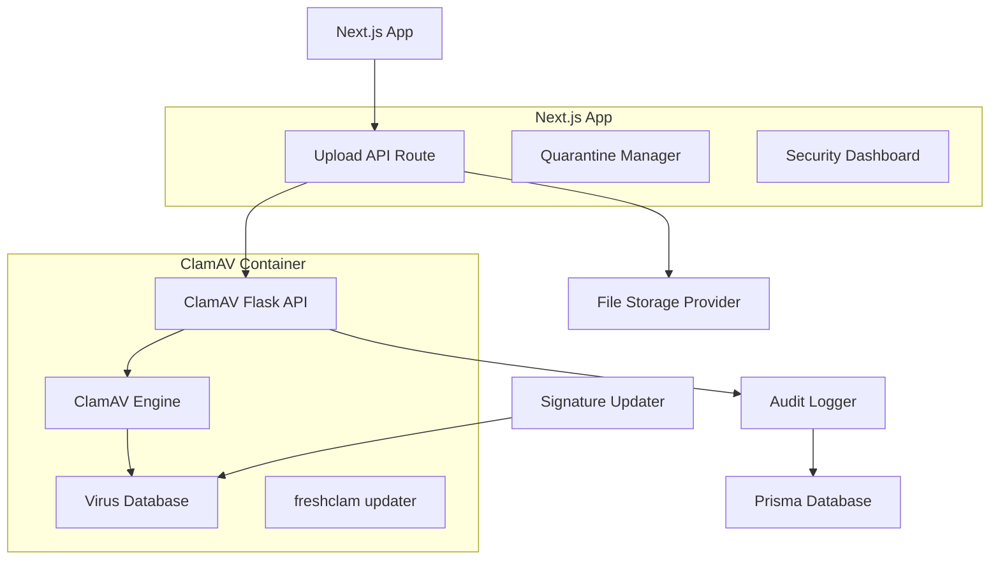

# ClamAV Integration Guide for Next.js Service Portal

## Overview

This guide demonstrates how to integrate ClamAV (Clam AntiVirus) - a free, open-source antivirus engine - into your Next.js accounting firm platform. ClamAV provides real-time malware detection for file uploads in your service portal, ensuring security for client document submissions and attachments.

**Key Benefits:**
- **Free & Open Source**: No licensing costs, full control over implementation
- **Production Ready**: Used by major email providers and web platforms
- **Real-time Scanning**: Immediate threat detection on file upload
- **Regular Updates**: Virus signature database updates multiple times daily
- **Containerized Deployment**: Easy scaling and maintenance via Docker

**Integration Points:**
- Service Request attachments (`/api/uploads`)
- Client document uploads in portal
- Admin file management operations
- Audit logging for security compliance

## Complete Current Directory Structure

```
your-accounting-platform/
├── clamav-service/                    # 🆕 ClamAV microservice
│   ├── Dockerfile
│   ├── docker-compose.yml
│   ├── start.sh
│   ├── app.py                        # Flask API for ClamAV
│   ├── requirements.txt
│   ├── .env                          # Local dev secrets (DO NOT commit)
│   ├── .dockerignore
│   └── README.md
├── src/
│   ├── app/
│   │   ├── api/
│   │   │   ├── uploads/
│   │   │   │   └── route.ts          # 🔄 Enhanced with AV scanning
│   │   │   ├── admin/
│   │   │   │   └── security/
│   │   │   │       ├── quarantine/
│   │   │   │       │   └── route.ts  # 🆕 Quarantine management
│   │   │   │       └── av-status/
│   │   │   │           └── route.ts  # 🆕 AV system status
│   │   │   └── cron/
│   │   │       └── av-update/
│   │   │           └── route.ts      # 🆕 Signature updates
│   │   ├── admin/
│   │   │   ├── security/
│   │   │   │   ├── page.tsx          # 🆕 Security dashboard
│   │   │   │   └── quarantine/
│   │   │   │       └── page.tsx      # 🆕 Quarantine UI
│   │   │   └── service-requests/
│   │   │       └── [id]/
│   │   │           └── page.tsx      # 🔄 Shows AV status
│   │   └── portal/
│   │       └── service-requests/
│   │           ├── new/
│   │           │   └── page.tsx      # 🔄 Upload with AV feedback
│   │           └── [id]/
│   │               └── page.tsx      # 🔄 Shows scan status
│   ├── lib/
│   │   ├── antivirus/
│   │   │   ├── client.ts             # 🆕 ClamAV API client
│   │   │   ├── types.ts              # 🆕 AV scan types
│   │   │   └── utils.ts              # 🆕 Scan helpers
│   │   ├── uploads.ts                # 🔄 Enhanced with AV
│   │   └── audit.ts                  # 🔄 AV event logging
│   ├── components/
│   │   ├── admin/
│   │   │   └── security/
│   │   │       ├── av-status.tsx     # 🆕 AV system status
│   │   │       ├── quarantine-table.tsx # 🆕 Quarantine management
│   │   │       └── scan-history.tsx  # 🆕 Scan audit trail
│   │   └── ui/
│   │       └── file-upload/
│   │           ├── upload-zone.tsx   # 🔄 With AV progress
│   │           └── scan-status.tsx   # 🆕 File scan indicator
│   └── types/
│       ├── antivirus.ts              # 🆕 AV type definitions
│       └── uploads.ts                # 🔄 Enhanced upload types
├── prisma/
│   ├── schema.prisma                 # 🔄 Added AV scan tables
│   └── migrations/                   # 🔄 AV schema migrations
├── scripts/
│   ├── setup-clamav.sh              # 🆕 Local development setup
│   └── deploy-clamav.sh              # 🆕 Production deployment
├── docs/
│   ├── clamav-integration.md         # 🆕 This document
│   ├── security-runbook.md           # 🆕 Security operations
│   └── service_portal_implementation_guide.md
└── docker-compose.yml               # 🔄 Added ClamAV service

Legend:
🆕 New files/directories
🔄 Modified existing files
```

## Component Architecture Details

### ClamAV Service Architecture



### Enhanced Upload Flow

```typescript
// Upload workflow with AV scanning
interface UploadWorkflow {
  1: "Client selects file"
  2: "Pre-upload validation (size, type)"
  3: "Upload to temporary storage"
  4: "Submit to ClamAV API for scanning"
  5: "Process scan result"
  6a: "If clean: move to permanent storage"
  6b: "If infected: quarantine and notify"
  7: "Update database with scan results"
  8: "Notify client of status"
}
```

### Security Components

**Upload Security Layer:**
```typescript
// src/components/ui/file-upload/upload-zone.tsx
interface UploadZoneProps {
  onUpload: (files: File[]) => void;
  allowedTypes: string[];
  maxSize: number;
  enableAV: boolean;          // 🆕 AV scanning toggle
  scanTimeout: number;        // 🆕 Max scan wait time
  onScanProgress: (status: AVScanStatus) => void; // 🆕
}

// src/components/ui/file-upload/scan-status.tsx
interface ScanStatusProps {
  fileId: string;
  scanResult: AVScanResult;
  onRetry: () => void;
  onQuarantine: () => void;
}
```

**Admin Security Dashboard:**
```typescript
// src/components/admin/security/av-status.tsx
interface AVStatusProps {
  systemHealth: {
    isOnline: boolean;
    lastUpdate: Date;
    dbVersion: string;
    scanQueue: number;
    threatCount: number;
  };
  recentScans: AVScanResult[];
}
```

## Custom Hooks

### useAntivirusClient Hook

```typescript
// src/hooks/useAntivirusClient.ts
import { useState, useCallback } from 'react';
import { AVScanResult, ScanRequest } from '@/types/antivirus';
import { antivirusClient } from '@/lib/antivirus/client';

interface UseAntivirusClient {
  scanFile: (file: File) => Promise<AVScanResult>;
  scanProgress: number;
  isScanning: boolean;
  lastScan: AVScanResult | null;
  error: string | null;
}

export function useAntivirusClient(): UseAntivirusClient {
  const [scanProgress, setScanProgress] = useState(0);
  const [isScanning, setIsScanning] = useState(false);
  const [lastScan, setLastScan] = useState<AVScanResult | null>(null);
  const [error, setError] = useState<string | null>(null);

  const scanFile = useCallback(async (file: File): Promise<AVScanResult> => {
    setIsScanning(true);
    setScanProgress(0);
    setError(null);

    try {
      // Progress simulation for UX
      const progressInterval = setInterval(() => {
        setScanProgress(prev => Math.min(prev + 10, 90));
      }, 200);

      const formData = new FormData();
      formData.append('file', file);

      const result = await antivirusClient.scanFile(formData);
      
      clearInterval(progressInterval);
      setScanProgress(100);
      setLastScan(result);
      
      return result;
    } catch (err) {
      setError(err instanceof Error ? err.message : 'Scan failed');
      throw err;
    } finally {
      setIsScanning(false);
      setTimeout(() => setScanProgress(0), 1000);
    }
  }, []);

  return {
    scanFile,
    scanProgress,
    isScanning,
    lastScan,
    error
  };
}
```

### useQuarantineManager Hook

```typescript
// src/hooks/useQuarantineManager.ts
import { useState, useCallback } from 'react';
import { QuarantineItem, QuarantineAction } from '@/types/antivirus';

export function useQuarantineManager() {
  const [items, setItems] = useState<QuarantineItem[]>([]);
  const [loading, setLoading] = useState(false);

  const loadQuarantineItems = useCallback(async () => {
    setLoading(true);
    try {
      const response = await fetch('/api/admin/security/quarantine');
      const data = await response.json();
      setItems(data.items);
    } finally {
      setLoading(false);
    }
  }, []);

  const performAction = useCallback(async (
    itemId: string, 
    action: QuarantineAction
  ) => {
    await fetch(`/api/admin/security/quarantine/${itemId}`, {
      method: 'PATCH',
      headers: { 'Content-Type': 'application/json' },
      body: JSON.stringify({ action })
    });
    
    // Refresh list
    await loadQuarantineItems();
  }, [loadQuarantineItems]);

  return {
    items,
    loading,
    loadQuarantineItems,
    performAction
  };
}
```

## API Architecture

### ClamAV Flask Service (Containerized)

```python
# clamav-service/app.py
from flask import Flask, request, jsonify
from werkzeug.utils import secure_filename
import tempfile, subprocess, os, time
import logging

app = Flask(__name__)
app.config['MAX_CONTENT_LENGTH'] = 50 * 1024 * 1024  # 50MB limit

# Logging setup
logging.basicConfig(level=logging.INFO)
logger = logging.getLogger(__name__)

ALLOWED_EXT = {
    'pdf', 'doc', 'docx', 'xls', 'xlsx', 'ppt', 'pptx',
    'png', 'jpg', 'jpeg', 'gif', 'webp', 'svg',
    'txt', 'csv', 'xml', 'json'
}

def allowed_filename(filename):
    return '.' in filename and \
           filename.rsplit('.', 1)[1].lower() in ALLOWED_EXT

@app.route('/health', methods=['GET'])
def health():
    """Health check endpoint"""
    try:
        # Check ClamAV daemon
        result = subprocess.run(['clamd', '--version'], 
                              capture_output=True, text=True, timeout=5)
        
        # Check database freshness
        db_info = subprocess.run(['sigtool', '--info', '/var/lib/clamav/main.cvd'],
                               capture_output=True, text=True, timeout=5)
        
        return jsonify({
            "status": "healthy",
            "clamav_version": result.stdout.strip() if result.returncode == 0 else "unknown",
            "database_info": db_info.stdout.strip() if db_info.returncode == 0 else "unknown",
            "timestamp": time.time()
        })
    except Exception as e:
        logger.error(f"Health check failed: {e}")
        return jsonify({"status": "unhealthy", "error": str(e)}), 500

@app.route('/scan', methods=['POST'])
def scan_file():
    """Scan uploaded file for malware"""
    start_time = time.time()
    
    # API key validation
    api_key = os.environ.get('AV_API_KEY')
    if api_key and request.headers.get('X-API-KEY') != api_key:
        return jsonify({"error": "unauthorized"}), 401

    # File validation
    if 'file' not in request.files:
        return jsonify({"error": "no file provided"}), 400

    file = request.files['file']
    if not file.filename:
        return jsonify({"error": "no filename"}), 400
        
    filename = secure_filename(file.filename)
    if not allowed_filename(filename):
        return jsonify({"error": "disallowed file type"}), 400

    # Create temporary file
    temp_file = tempfile.NamedTemporaryFile(delete=False, suffix=f"_{filename}")
    
    try:
        # Save uploaded file
        file.save(temp_file.name)
        temp_file.close()
        
        # Get file stats
        file_size = os.path.getsize(temp_file.name)
        
        logger.info(f"Scanning file: {filename} ({file_size} bytes)")
        
        # Run ClamAV scan
        scan_result = subprocess.run([
            'clamdscan', 
            '--no-summary',
            '--infected',
            temp_file.name
        ], capture_output=True, text=True, timeout=120)
        
        scan_time = time.time() - start_time
        
        # Parse results
        if scan_result.returncode == 0:
            status = 'clean'
            threat = None
        elif scan_result.returncode == 1:
            status = 'infected'
            # Extract threat name from output
            output_lines = scan_result.stdout.strip().split('\n')
            threat = output_lines[-1].split(': ')[-1] if output_lines else 'Unknown threat'
        else:
            status = 'error'
            threat = None
            
        response_data = {
            "status": status,
            "filename": filename,
            "file_size": file_size,
            "scan_time": round(scan_time, 3),
            "threat_name": threat,
            "scan_output": scan_result.stdout.strip(),
            "timestamp": time.time()
        }
        
        if status == 'error':
            response_data["error_details"] = scan_result.stderr.strip()
            
        logger.info(f"Scan completed: {filename} -> {status} ({scan_time:.3f}s)")
        
        return jsonify(response_data)
        
    except subprocess.TimeoutExpired:
        logger.error(f"Scan timeout for file: {filename}")
        return jsonify({
            "error": "scan timeout",
            "filename": filename,
            "scan_time": time.time() - start_time
        }), 500
        
    except Exception as e:
        logger.error(f"Scan failed for file {filename}: {e}")
        return jsonify({
            "error": "scan failed",
            "filename": filename,
            "details": str(e)
        }), 500
        
    finally:
        # Cleanup
        try:
            os.unlink(temp_file.name)
        except Exception as cleanup_error:
            logger.warning(f"Failed to cleanup temp file: {cleanup_error}")

@app.route('/update', methods=['POST'])
def update_signatures():
    """Trigger virus signature database update"""
    api_key = os.environ.get('AV_API_KEY')
    if api_key and request.headers.get('X-API-KEY') != api_key:
        return jsonify({"error": "unauthorized"}), 401
        
    try:
        result = subprocess.run(['freshclam'], capture_output=True, text=True, timeout=300)
        
        return jsonify({
            "status": "updated" if result.returncode == 0 else "failed",
            "output": result.stdout.strip(),
            "error": result.stderr.strip() if result.returncode != 0 else None
        })
    except subprocess.TimeoutExpired:
        return jsonify({"error": "update timeout"}), 500
    except Exception as e:
        return jsonify({"error": "update failed", "details": str(e)}), 500

if __name__ == '__main__':
    app.run(host='0.0.0.0', port=8080, debug=False)
```

### Enhanced Next.js Upload API

```typescript
// src/app/api/uploads/route.ts (Enhanced with AV scanning)
import { NextRequest, NextResponse } from 'next/server';
import { getServerSession } from 'next-auth';
import { authOptions } from '@/lib/auth';
import { antivirusClient } from '@/lib/antivirus/client';
import { logAudit } from '@/lib/audit';
import { rateLimit } from '@/lib/rate-limit';
import prisma from '@/lib/prisma';

const UPLOAD_PROVIDERS = {
  'netlify': async (file: File, metadata: any) => {
    const { put } = await import('@netlify/blobs');
    const arrayBuffer = await file.arrayBuffer();
    const key = `uploads/${Date.now()}-${file.name}`;
    
    await put(key, arrayBuffer, {
      metadata: {
        contentType: file.type,
        originalName: file.name,
        ...metadata
      }
    });
    
    return {
      key,
      url: `${process.env.NETLIFY_URL}/.netlify/blobs/${key}`,
      provider: 'netlify'
    };
  }
};

export async function POST(request: NextRequest) {
  try {
    // Rate limiting
    const clientIp = request.ip || 'unknown';
    const rateLimitResult = await rateLimit.check(clientIp, 'upload');
    
    if (!rateLimitResult.success) {
      return NextResponse.json(
        { error: 'Rate limit exceeded' },
        { status: 429 }
      );
    }

    // Authentication
    const session = await getServerSession(authOptions);
    if (!session?.user) {
      return NextResponse.json(
        { error: 'Authentication required' },
        { status: 401 }
      );
    }

    // Parse multipart form data
    const formData = await request.formData();
    const file = formData.get('file') as File;
    
    if (!file) {
      return NextResponse.json(
        { error: 'No file provided' },
        { status: 400 }
      );
    }

    // File validation
    const maxSize = 50 * 1024 * 1024; // 50MB
    if (file.size > maxSize) {
      return NextResponse.json(
        { error: 'File too large', maxSize },
        { status: 413 }
      );
    }

    // Content type validation
    const allowedTypes = [
      'application/pdf',
      'application/msword',
      'application/vnd.openxmlformats-officedocument.wordprocessingml.document',
      'application/vnd.ms-excel',
      'application/vnd.openxmlformats-officedocument.spreadsheetml.sheet',
      'image/png',
      'image/jpeg',
      'image/gif',
      'text/plain',
      'text/csv'
    ];
    
    if (!allowedTypes.includes(file.type)) {
      return NextResponse.json(
        { error: 'File type not allowed', allowedTypes },
        { status: 400 }
      );
    }

    // Step 1: Antivirus scanning
    let scanResult;
    try {
      scanResult = await antivirusClient.scanFile(file);
    } catch (error) {
      await logAudit({
        action: 'UPLOAD_AV_SCAN_FAILED',
        userId: session.user.id!,
        metadata: {
          filename: file.name,
          fileSize: file.size,
          error: error instanceof Error ? error.message : 'Unknown error'
        }
      });
      
      return NextResponse.json(
        { error: 'Antivirus scan failed', details: 'Please try again later' },
        { status: 503 }
      );
    }

    // Step 2: Handle scan results
    if (scanResult.status === 'infected') {
      // Quarantine the file
      await prisma.quarantineItem.create({
        data: {
          filename: file.name,
          fileSize: file.size,
          contentType: file.type,
          threatName: scanResult.threat_name || 'Unknown threat',
          uploadedBy: session.user.id!,
          scanDetails: scanResult,
          status: 'QUARANTINED'
        }
      });

      await logAudit({
        action: 'UPLOAD_THREAT_DETECTED',
        userId: session.user.id!,
        metadata: {
          filename: file.name,
          threatName: scanResult.threat_name,
          scanTime: scanResult.scan_time
        }
      });

      return NextResponse.json(
        {
          error: 'Security threat detected',
          details: 'File has been quarantined for security review',
          scanResult
        },
        { status: 403 }
      );
    }

    if (scanResult.status === 'error') {
      await logAudit({
        action: 'UPLOAD_AV_SCAN_ERROR',
        userId: session.user.id!,
        metadata: {
          filename: file.name,
          scanError: scanResult.error_details
        }
      });

      return NextResponse.json(
        { error: 'Security scan inconclusive', details: 'Please contact support' },
        { status: 503 }
      );
    }

    // Step 3: Upload clean file to storage
    const provider = process.env.UPLOADS_PROVIDER || 'netlify';
    const uploadProvider = UPLOAD_PROVIDERS[provider as keyof typeof UPLOAD_PROVIDERS];
    
    if (!uploadProvider) {
      return NextResponse.json(
        { error: 'Upload provider not configured' },
        { status: 501 }
      );
    }

    const uploadResult = await uploadProvider(file, {
      uploadedBy: session.user.id,
      scanStatus: 'clean',
      scanTime: scanResult.scan_time,
      avVersion: scanResult.av_version
    });

    // Step 4: Store file metadata
    const fileRecord = await prisma.attachment.create({
      data: {
        filename: file.name,
        originalName: file.name,
        contentType: file.type,
        fileSize: file.size,
        storageKey: uploadResult.key,
        storageUrl: uploadResult.url,
        uploadedBy: session.user.id!,
        avStatus: 'CLEAN',
        avScanResult: scanResult,
        avScanAt: new Date()
      }
    });

    // Step 5: Audit logging
    await logAudit({
      action: 'UPLOAD_COMPLETED',
      userId: session.user.id!,
      metadata: {
        attachmentId: fileRecord.id,
        filename: file.name,
        fileSize: file.size,
        scanTime: scanResult.scan_time,
        provider
      }
    });

    return NextResponse.json({
      success: true,
      data: {
        id: fileRecord.id,
        filename: file.name,
        size: file.size,
        url: uploadResult.url,
        avStatus: 'clean',
        scanTime: scanResult.scan_time
      }
    });

  } catch (error) {
    console.error('Upload error:', error);
    
    return NextResponse.json(
      { error: 'Upload failed', details: 'Internal server error' },
      { status: 500 }
    );
  }
}
```

### Quarantine Management API

```typescript
// src/app/api/admin/security/quarantine/route.ts
import { NextRequest, NextResponse } from 'next/server';
import { getServerSession } from 'next-auth';
import { authOptions } from '@/lib/auth';
import { hasPermission } from '@/lib/permissions';
import prisma from '@/lib/prisma';

export async function GET(request: NextRequest) {
  const session = await getServerSession(authOptions);
  
  if (!session?.user || !hasPermission(session.user.role, 'SECURITY_MANAGE')) {
    return NextResponse.json({ error: 'Unauthorized' }, { status: 401 });
  }

  const { searchParams } = new URL(request.url);
  const page = parseInt(searchParams.get('page') || '1');
  const limit = parseInt(searchParams.get('limit') || '50');
  const status = searchParams.get('status') || 'ALL';

  const where = status !== 'ALL' ? { status } : {};
  
  const [items, total] = await Promise.all([
    prisma.quarantineItem.findMany({
      where,
      include: {
        uploadedByUser: {
          select: { id: true, name: true, email: true }
        }
      },
      orderBy: { createdAt: 'desc' },
      skip: (page - 1) * limit,
      take: limit
    }),
    prisma.quarantineItem.count({ where })
  ]);

  return NextResponse.json({
    success: true,
    data: {
      items,
      pagination: {
        page,
        limit,
        total,
        pages: Math.ceil(total / limit)
      }
    }
  });
}

// Individual quarantine item management
// src/app/api/admin/security/quarantine/[id]/route.ts
export async function PATCH(
  request: NextRequest,
  { params }: { params: { id: string } }
) {
  const session = await getServerSession(authOptions);
  
  if (!session?.user || !hasPermission(session.user.role, 'SECURITY_MANAGE')) {
    return NextResponse.json({ error: 'Unauthorized' }, { status: 401 });
  }

  const { action } = await request.json();
  const itemId = params.id;

  const item = await prisma.quarantineItem.findUnique({
    where: { id: itemId }
  });

  if (!item) {
    return NextResponse.json({ error: 'Item not found' }, { status: 404 });
  }

  switch (action) {
    case 'DELETE':
      await prisma.quarantineItem.update({
        where: { id: itemId },
        data: { 
          status: 'DELETED',
          reviewedBy: session.user.id!,
          reviewedAt: new Date()
        }
      });
      break;

    case 'RESTORE':
      // Re-scan and potentially restore
      await prisma.quarantineItem.update({
        where: { id: itemId },
        data: { 
          status: 'UNDER_REVIEW',
          reviewedBy: session.user.id!,
          reviewedAt: new Date()
        }
      });
      break;

    case 'WHITELIST':
      await prisma.quarantineItem.update({
        where: { id: itemId },
        data: { 
          status: 'WHITELISTED',
          reviewedBy: session.user.id!,
          reviewedAt: new Date()
        }
      });
      break;

    default:
      return NextResponse.json({ error: 'Invalid action' }, { status: 400 });
  }

  await logAudit({
    action: 'QUARANTINE_ITEM_ACTION',
    userId: session.user.id!,
    metadata: {
      itemId,
      action,
      filename: item.filename,
      threatName: item.threatName
    }
  });

  return NextResponse.json({ success: true });
}
```

## Code Samples

### Docker Configuration

```dockerfile
# clamav-service/Dockerfile
FROM python:3.11-slim

ENV DEBIAN_FRONTEND=noninteractive

# Install ClamAV and dependencies
RUN apt-get update && \
    apt-get install -y --no-install-recommends \
      clamav clamav-daemon clamav-freshclam \
      gcc libssl-dev make curl \
    && rm -rf /var/lib/apt/lists/*

# Configure ClamAV
RUN sed -i 's/^Foreground .*$/Foreground true/' /etc/clamav/clamd.conf && \
    sed -i 's/^Foreground .*$/Foreground true/' /etc/clamav/freshclam.conf && \
    mkdir -p /var/run/clamav && \
    chown clamav:clamav /var/run/clamav

# Install Python dependencies
WORKDIR /app
COPY requirements.txt /app/
RUN pip install --no-cache-dir -r requirements.txt

# Copy application
COPY app.py start.sh /app/
RUN chmod +x /app/start.sh

# Initialize virus database
RUN freshclam --quiet || true

# Health check
HEALTHCHECK --interval=30s --timeout=10s --start-period=60s --retries=3 \
  CMD curl -f http://localhost:8080/health || exit 1

EXPOSE 8080
CMD ["/app/start.sh"]
```

```bash
#!/bin/sh
# clamav-service/start.sh
set -e

echo "Starting ClamAV services..."

# Update virus definitions
echo "Updating virus definitions..."
freshclam --quiet || echo "Warning: Initial freshclam update failed"

# Start ClamAV daemon in background
echo "Starting ClamAV daemon..."
clamd &

# Wait for daemon to be ready
sleep 10

# Start background updater
echo "Starting signature updater..."
(
  while true; do
    sleep 3600  # Update every hour
    echo "Running scheduled virus definition update..."
    freshclam --quiet || echo "Scheduled update failed"
  done
) &

# Start Flask API
echo "Starting Flask API server..."
exec gunicorn --bind 0.0.0.0:8080 --workers 2 --timeout 120 app:app

```

```yaml
# clamav-service/docker-compose.yml
version: "3.8"

services:
  clamav-api:
    build: .
    ports:
      - "8080:8080"
    environment:
      - AV_API_KEY=${AV_API_KEY:-supersecretkey123}
    volumes:
      - clamav_db:/var/lib/clamav
      - ./logs:/app/logs
    healthcheck:
      test: ["CMD", "curl", "-f", "http://localhost:8080/health"]
      interval: 30s
      timeout: 10s
      retries: 3
      start_period: 60s
    restart: unless-stopped
    deploy:
      resources:
        limits:
          memory: 1G
          cpus: '1.0'
        reservations:
          memory: 512M
          cpus: '0.5'

volumes:
  clamav_db:
    driver: local
```

```python
# clamav-service/requirements.txt
flask==2.3.3
gunicorn==21.2.0
werkzeug==2.3.7
```

### Prisma Schema Extensions

```prisma
// prisma/schema.prisma - Add to existing schema

model Attachment {
  id              String   @id @default(cuid())
  filename        String
  originalName    String
  contentType     String
  fileSize        Int
  storageKey      String
  storageUrl      String?
  uploadedBy      String
  uploadedByUser  User     @relation(fields: [uploadedBy], references: [id])
  
  // Antivirus fields
  avStatus        AVStatus @default(PENDING)
  avScanResult    Json?    // Store full scan response
  avScanAt        DateTime?
  avThreatName    String?
  avScanTime      Float?   // Scan duration in seconds
  
  // Relations
  serviceRequestId String?
  serviceRequest   ServiceRequest? @relation(fields: [serviceRequestId], references: [id])
  
  createdAt       DateTime @default(now())
  updatedAt       DateTime @updatedAt
  
  @@index([uploadedBy])
  @@index([avStatus])
  @@index([serviceRequestId])
}

model QuarantineItem {
  id              String   @id @default(cuid())
  filename        String
  fileSize        Int
  contentType     String
  threatName      String
  scanDetails     Json     // Full AV scan response
  
  // Quarantine management
  status          QuarantineStatus @default(QUARANTINED)
  uploadedBy      String
  uploadedByUser  User     @relation(fields: [uploadedBy], references: [id])
  reviewedBy      String?
  reviewedByUser  User?    @relation(fields: [reviewedBy], references: [id], name: "ReviewedQuarantineItems")
  reviewedAt      DateTime?
  
  createdAt       DateTime @default(now())
  updatedAt       DateTime @updatedAt
  
  @@index([status])
  @@index([uploadedBy])
}

model AVScanLog {
  id              String   @id @default(cuid())
  filename        String
  fileSize        Int
  scanResult      AVStatus
  threatName      String?
  scanTime        Float    // Duration in seconds
  scanDetails     Json
  
  // Context
  uploadedBy      String
  uploadedByUser  User     @relation(fields: [uploadedBy], references: [id])
  attachmentId    String?
  attachment      Attachment? @relation(fields: [attachmentId], references: [id])
  
  createdAt       DateTime @default(now())
  
  @@index([scanResult])
  @@index([createdAt])
  @@index([uploadedBy])
}

enum AVStatus {
  PENDING
  SCANNING
  CLEAN
  INFECTED
  ERROR
  QUARANTINED
}

enum QuarantineStatus {
  QUARANTINED
  UNDER_REVIEW
  WHITELISTED
  DELETED
}

// Update User model to include AV relations
model User {
  // ... existing fields
  
  // AV relations
  attachments          Attachment[]
  quarantineItems      QuarantineItem[]
  reviewedQuarantine   QuarantineItem[] @relation("ReviewedQuarantineItems")
  avScanLogs           AVScanLog[]
}
```

### Type Definitions

```typescript
// src/types/antivirus.ts
export interface AVScanResult {
  status: 'clean' | 'infected' | 'error';
  filename: string;
  file_size: number;
  scan_time: number;
  threat_name?: string;
  scan_output: string;
  error_details?: string;
  timestamp: number;
  av_version?: string;
}

export interface AVSystemHealth {
  status: 'healthy' | 'unhealthy';
  clamav_version: string;
  database_info: string;
  last_update: Date;
  scan_queue_size: number;
  total_scans_today: number;
  threats_detected_today: number;
}

export interface QuarantineItem {
  id: string;
  filename: string;
  fileSize: number;
  contentType: string;
  threatName: string;
  status: 'QUARANTINED' | 'UNDER_REVIEW' | 'WHITELISTED' | 'DELETED';
  uploadedBy: string;
  uploadedByUser: {
    id: string;
    name: string;
    email: string;
  };
  reviewedBy?: string;
  reviewedAt?: Date;
  createdAt: Date;
}

export type QuarantineAction = 'DELETE' | 'RESTORE' | 'WHITELIST';

export interface ScanRequest {
  file: File;
  context?: {
    serviceRequestId?: string;
    uploadType?: string;
  };
}

export interface AVClientConfig {
  baseUrl: string;
  apiKey: string;
  timeout: number;
  retries: number;
}
```

### Antivirus Client Library

```typescript
// src/lib/antivirus/client.ts
import { AVScanResult, AVSystemHealth, AVClientConfig } from '@/types/antivirus';

class AntivirusClient {
  private config: AVClientConfig;

  constructor(config?: Partial<AVClientConfig>) {
    this.config = {
      baseUrl: process.env.CLAMAV_API_URL || 'http://localhost:8080',
      apiKey: process.env.CLAMAV_API_KEY || '',
      timeout: 120000, // 2 minutes
      retries: 2,
      ...config
    };
  }

  private async makeRequest(
    endpoint: string, 
    options: RequestInit = {}
  ): Promise<Response> {
    const url = `${this.config.baseUrl}${endpoint}`;
    const headers = {
      'X-API-KEY': this.config.apiKey,
      ...options.headers
    };

    let lastError: Error;
    
    for (let attempt = 0; attempt <= this.config.retries; attempt++) {
      try {
        const response = await fetch(url, {
          ...options,
          headers,
          signal: AbortSignal.timeout(this.config.timeout)
        });

        if (!response.ok) {
          throw new Error(`HTTP ${response.status}: ${response.statusText}`);
        }

        return response;
      } catch (error) {
        lastError = error instanceof Error ? error : new Error('Unknown error');
        
        if (attempt < this.config.retries) {
          // Exponential backoff
          const delay = Math.pow(2, attempt) * 1000;
          await new Promise(resolve => setTimeout(resolve, delay));
        }
      }
    }

    throw lastError!;
  }

  async scanFile(file: File | FormData): Promise<AVScanResult> {
    const formData = file instanceof FormData ? file : new FormData();
    if (file instanceof File) {
      formData.append('file', file);
    }

    const response = await this.makeRequest('/scan', {
      method: 'POST',
      body: formData
    });

    const result = await response.json();
    return result as AVScanResult;
  }

  async getSystemHealth(): Promise<AVSystemHealth> {
    const response = await this.makeRequest('/health');
    const health = await response.json();
    
    return {
      ...health,
      last_update: new Date(health.timestamp * 1000),
      scan_queue_size: 0, // Would come from additional endpoint
      total_scans_today: 0, // Would come from additional endpoint  
      threats_detected_today: 0 // Would come from additional endpoint
    };
  }

  async updateSignatures(): Promise<{ status: string; output?: string; error?: string }> {
    const response = await this.makeRequest('/update', {
      method: 'POST'
    });

    return response.json();
  }

  async isHealthy(): Promise<boolean> {
    try {
      const health = await this.getSystemHealth();
      return health.status === 'healthy';
    } catch {
      return false;
    }
  }
}

// Singleton instance
export const antivirusClient = new AntivirusClient();

// Utility functions
export async function scanFileWithFallback(file: File): Promise<AVScanResult> {
  try {
    return await antivirusClient.scanFile(file);
  } catch (error) {
    console.warn('Antivirus scan failed, allowing upload:', error);
    
    // Fallback response when AV is unavailable
    return {
      status: 'clean',
      filename: file.name,
      file_size: file.size,
      scan_time: 0,
      scan_output: 'AV service unavailable - file allowed',
      timestamp: Date.now() / 1000
    };
  }
}

export function isAvailableError(error: unknown): boolean {
  if (error instanceof Error) {
    return error.message.includes('fetch') || 
           error.message.includes('timeout') ||
           error.message.includes('ECONNREFUSED');
  }
  return false;
}
```

### Enhanced Upload Components

```tsx
// src/components/ui/file-upload/upload-zone.tsx
'use client';

import { useState, useCallback } from 'react';
import { Upload, Shield, AlertTriangle, CheckCircle } from 'lucide-react';
import { useAntivirusClient } from '@/hooks/useAntivirusClient';
import { ScanStatus } from './scan-status';
import { cn } from '@/lib/utils';

interface UploadZoneProps {
  onUpload: (files: UploadResult[]) => void;
  allowedTypes?: string[];
  maxSize?: number;
  maxFiles?: number;
  enableAV?: boolean;
  className?: string;
}

interface UploadResult {
  file: File;
  id: string;
  url?: string;
  avStatus: 'pending' | 'scanning' | 'clean' | 'infected' | 'error';
  avResult?: any;
  error?: string;
}

export function UploadZone({
  onUpload,
  allowedTypes = ['application/pdf', 'image/*', 'text/*'],
  maxSize = 50 * 1024 * 1024, // 50MB
  maxFiles = 5,
  enableAV = true,
  className
}: UploadZoneProps) {
  const [isDragging, setIsDragging] = useState(false);
  const [uploads, setUploads] = useState<Map<string, UploadResult>>(new Map());
  
  const { scanFile, isScanning, scanProgress } = useAntivirusClient();

  const processFiles = useCallback(async (files: FileList) => {
    const fileArray = Array.from(files).slice(0, maxFiles);
    const newUploads = new Map(uploads);

    for (const file of fileArray) {
      const uploadId = `${Date.now()}-${Math.random().toString(36).substr(2, 9)}`;
      
      // Initial upload result
      const uploadResult: UploadResult = {
        file,
        id: uploadId,
        avStatus: 'pending'
      };

      newUploads.set(uploadId, uploadResult);
      setUploads(new Map(newUploads));

      try {
        // File validation
        if (file.size > maxSize) {
          throw new Error(`File too large (max ${Math.round(maxSize / 1024 / 1024)}MB)`);
        }

        // Start AV scan if enabled
        if (enableAV) {
          uploadResult.avStatus = 'scanning';
          setUploads(new Map(newUploads));

          const scanResult = await scanFile(file);
          uploadResult.avResult = scanResult;

          if (scanResult.status === 'infected') {
            uploadResult.avStatus = 'infected';
            uploadResult.error = `Threat detected: ${scanResult.threat_name}`;
          } else if (scanResult.status === 'error') {
            uploadResult.avStatus = 'error';
            uploadResult.error = 'Security scan failed';
          } else {
            uploadResult.avStatus = 'clean';
            
            // Upload to server
            const formData = new FormData();
            formData.append('file', file);

            const response = await fetch('/api/uploads', {
              method: 'POST',
              body: formData
            });

            const result = await response.json();
            
            if (result.success) {
              uploadResult.url = result.data.url;
            } else {
              throw new Error(result.error || 'Upload failed');
            }
          }
        }

        newUploads.set(uploadId, uploadResult);
        setUploads(new Map(newUploads));

      } catch (error) {
        uploadResult.avStatus = 'error';
        uploadResult.error = error instanceof Error ? error.message : 'Unknown error';
        newUploads.set(uploadId, uploadResult);
        setUploads(new Map(newUploads));
      }
    }

    // Notify parent of clean uploads
    const cleanUploads = Array.from(newUploads.values()).filter(
      upload => upload.avStatus === 'clean'
    );
    onUpload(cleanUploads);
  }, [uploads, maxFiles, maxSize, enableAV, scanFile, onUpload]);

  const handleDrop = useCallback((e: React.DragEvent) => {
    e.preventDefault();
    setIsDragging(false);
    
    const files = e.dataTransfer.files;
    if (files.length > 0) {
      processFiles(files);
    }
  }, [processFiles]);

  const handleFileInput = useCallback((e: React.ChangeEvent<HTMLInputElement>) => {
    const files = e.target.files;
    if (files) {
      processFiles(files);
    }
  }, [processFiles]);

  return (
    <div className={cn("space-y-4", className)}>
      {/* Drop Zone */}
      <div
        className={cn(
          "border-2 border-dashed rounded-lg p-8 text-center transition-colors",
          isDragging ? "border-blue-500 bg-blue-50" : "border-gray-300 hover:border-gray-400",
          "cursor-pointer"
        )}
        onDrop={handleDrop}
        onDragOver={(e) => {
          e.preventDefault();
          setIsDragging(true);
        }}
        onDragLeave={() => setIsDragging(false)}
        onClick={() => document.getElementById('file-input')?.click()}
      >
        <input
          id="file-input"
          type="file"
          multiple
          accept={allowedTypes.join(',')}
          onChange={handleFileInput}
          className="hidden"
        />
        
        <div className="flex flex-col items-center gap-3">
          <Upload className="h-8 w-8 text-gray-400" />
          <div>
            <p className="text-sm font-medium text-gray-900">
              Drop files here or click to browse
            </p>
            <p className="text-xs text-gray-500 mt-1">
              Max {maxFiles} files, {Math.round(maxSize / 1024 / 1024)}MB each
            </p>
            {enableAV && (
              <div className="flex items-center gap-1 mt-2 text-xs text-green-600">
                <Shield className="h-3 w-3" />
                <span>Antivirus scanning enabled</span>
              </div>
            )}
          </div>
        </div>
      </div>

      {/* Upload Progress */}
      {uploads.size > 0 && (
        <div className="space-y-2">
          <h4 className="text-sm font-medium text-gray-900">Upload Status</h4>
          {Array.from(uploads.values()).map((upload) => (
            <ScanStatus
              key={upload.id}
              upload={upload}
              progress={upload.id === uploads.keys().next().value ? scanProgress : 0}
              onRetry={() => {
                // Remove failed upload and retry
                const newUploads = new Map(uploads);
                newUploads.delete(upload.id);
                setUploads(newUploads);
                processFiles(new DataTransfer().files);
              }}
            />
          ))}
        </div>
      )}
    </div>
  );
}
```

```tsx
// src/components/ui/file-upload/scan-status.tsx
'use client';

import { Shield, CheckCircle, AlertTriangle, XCircle, RefreshCw } from 'lucide-react';
import { Button } from '@/components/ui/button';
import { Progress } from '@/components/ui/progress';
import { cn } from '@/lib/utils';

interface ScanStatusProps {
  upload: {
    file: File;
    id: string;
    avStatus: 'pending' | 'scanning' | 'clean' | 'infected' | 'error';
    avResult?: any;
    error?: string;
  };
  progress?: number;
  onRetry?: () => void;
}

export function ScanStatus({ upload, progress = 0, onRetry }: ScanStatusProps) {
  const getStatusIcon = () => {
    switch (upload.avStatus) {
      case 'pending':
        return <Shield className="h-4 w-4 text-gray-400" />;
      case 'scanning':
        return <RefreshCw className="h-4 w-4 text-blue-500 animate-spin" />;
      case 'clean':
        return <CheckCircle className="h-4 w-4 text-green-500" />;
      case 'infected':
        return <AlertTriangle className="h-4 w-4 text-red-500" />;
      case 'error':
        return <XCircle className="h-4 w-4 text-orange-500" />;
    }
  };

  const getStatusColor = () => {
    switch (upload.avStatus) {
      case 'pending':
        return 'text-gray-600';
      case 'scanning':
        return 'text-blue-600';
      case 'clean':
        return 'text-green-600';
      case 'infected':
        return 'text-red-600';
      case 'error':
        return 'text-orange-600';
    }
  };

  const getStatusText = () => {
    switch (upload.avStatus) {
      case 'pending':
        return 'Queued for scanning';
      case 'scanning':
        return 'Scanning for threats...';
      case 'clean':
        return `Clean (scanned in ${upload.avResult?.scan_time?.toFixed(2)}s)`;
      case 'infected':
        return upload.error || 'Threat detected';
      case 'error':
        return upload.error || 'Scan failed';
    }
  };

  return (
    <div className={cn(
      "flex items-center gap-3 p-3 rounded-lg border",
      upload.avStatus === 'infected' && "border-red-200 bg-red-50",
      upload.avStatus === 'error' && "border-orange-200 bg-orange-50",
      upload.avStatus === 'clean' && "border-green-200 bg-green-50",
      upload.avStatus === 'scanning' && "border-blue-200 bg-blue-50"
    )}>
      {getStatusIcon()}
      
      <div className="flex-1 min-w-0">
        <div className="flex items-center justify-between">
          <p className="text-sm font-medium text-gray-900 truncate">
            {upload.file.name}
          </p>
          <span className="text-xs text-gray-500">
            {Math.round(upload.file.size / 1024)}KB
          </span>
        </div>
        
        <p className={cn("text-xs mt-1", getStatusColor())}>
          {getStatusText()}
        </p>
        
        {upload.avStatus === 'scanning' && progress > 0 && (
          <Progress value={progress} className="mt-2 h-1" />
        )}
      </div>
      
      {(upload.avStatus === 'error' || upload.avStatus === 'infected') && onRetry && (
        <Button
          variant="outline"
          size="sm"
          onClick={onRetry}
          className="flex-shrink-0"
        >
          Retry
        </Button>
      )}
    </div>
  );
}
```

## Self-host ClamAV (Free & Open Source)

### Production Deployment Options

#### Option 1: Docker on VPS/Cloud (Recommended)

```bash
#!/bin/bash
# scripts/deploy-clamav.sh - Production deployment script

set -e

echo "🚀 Deploying ClamAV service to production..."

# Build and push Docker image
docker build -t your-registry/clamav-api:latest ./clamav-service
docker push your-registry/clamav-api:latest

# Deploy to server (example for DigitalOcean/Render/Railway)
cat << EOF > docker-compose.prod.yml
version: "3.8"

services:
  clamav-api:
    image: your-registry/clamav-api:latest
    ports:
      - "8080:8080"
    environment:
      - AV_API_KEY=\${AV_API_KEY}
    volumes:
      - clamav_db:/var/lib/clamav
      - ./logs:/app/logs
    healthcheck:
      test: ["CMD", "curl", "-f", "http://localhost:8080/health"]
      interval: 30s
      timeout: 10s
      retries: 3
    restart: unless-stopped
    deploy:
      resources:
        limits:
          memory: 2G
          cpus: '1.5'

  nginx:
    image: nginx:alpine
    ports:
      - "443:443"
      - "80:80"
    volumes:
      - ./nginx.conf:/etc/nginx/nginx.conf
      - ./ssl:/etc/nginx/ssl
    depends_on:
      - clamav-api
    restart: unless-stopped

volumes:
  clamav_db:
EOF

# Deploy with SSL termination
docker-compose -f docker-compose.prod.yml up -d

echo "✅ ClamAV service deployed successfully!"
echo "🔧 Set environment variables:"
echo "   - CLAMAV_API_URL=https://your-av-domain.com"
echo "   - CLAMAV_API_KEY=your-strong-api-key"
```

#### Option 2: Netlify Functions + Docker (Serverless)

```yaml
# netlify.toml (add to existing)
[build]
  functions = "netlify/functions"

[[plugins]]
  package = "@netlify/plugin-docker"

[build.environment]
  DOCKER_BUILDKIT = "1"

[[redirects]]
  from = "/api/av/*"
  to = "https://your-clamav-service.herokuapp.com/:splat"
  status = 200
```

#### Option 3: Railway/Render One-Click Deploy

```yaml
# railway.yml or render.yml
services:
  - type: web
    name: clamav-api
    env: docker
    dockerfilePath: ./clamav-service/Dockerfile
    buildCommand: docker build -t clamav-api .
    startCommand: /app/start.sh
    healthCheckPath: /health
    envVars:
      - key: AV_API_KEY
        generateValue: true
    disk:
      name: clamav-db
      mountPath: /var/lib/clamav
      sizeGB: 5
    plan: starter # 1GB RAM, 0.5 vCPU
```

### Environment Configuration

```bash
# .env.production (DO NOT commit)
# Set these in your hosting platform:

# Next.js App
CLAMAV_API_URL=https://your-clamav-service.com
CLAMAV_API_KEY=your-very-strong-api-key-here
UPLOADS_PROVIDER=netlify
NETLIFY_BLOBS_TOKEN=your-netlify-blobs-token

# ClamAV Service  
AV_API_KEY=your-very-strong-api-key-here

# Optional: Custom database URLs
REALTIME_TRANSPORT=postgres
DATABASE_URL=your-neon-postgres-url
```

### Local Development Setup

```bash
#!/bin/bash
# scripts/setup-clamav.sh - Local development setup

echo "🔧 Setting up ClamAV for local development..."

# Option 1: Docker Compose (Recommended)
cd clamav-service
cp .env.example .env
echo "AV_API_KEY=dev-secret-key" >> .env

docker-compose up -d
echo "Waiting for ClamAV to initialize (this may take a few minutes)..."
sleep 60

# Test health
curl http://localhost:8080/health

echo "✅ ClamAV is ready at http://localhost:8080"

# Option 2: Native installation (Ubuntu/Debian)
if command -v apt-get >/dev/null; then
    echo "Installing ClamAV natively..."
    sudo apt-get update
    sudo apt-get install -y clamav clamav-daemon clamav-freshclam
    sudo freshclam
    sudo systemctl enable clamav-daemon
    sudo systemctl start clamav-daemon
    
    # Install Python service
    cd ../clamav-service
    pip install -r requirements.txt
    export AV_API_KEY=dev-secret-key
    python app.py &
    
    echo "✅ Native ClamAV setup complete"
fi

# Update your Next.js .env.local
cd ..
cat >> .env.local << EOF

# ClamAV Configuration
CLAMAV_API_URL=http://localhost:8080
CLAMAV_API_KEY=dev-secret-key
EOF

echo "🎉 Setup complete! Start your Next.js app:"
echo "   npm run dev"
```

### Monitoring and Maintenance

```typescript
// src/app/api/cron/av-update/route.ts - Automated signature updates
import { NextRequest, NextResponse } from 'next/server';
import { antivirusClient } from '@/lib/antivirus/client';
import { logAudit } from '@/lib/audit';

export async function POST(request: NextRequest) {
  // Verify cron secret
  const cronSecret = process.env.CRON_SECRET;
  const authHeader = request.headers.get('authorization');
  
  if (!cronSecret || authHeader !== `Bearer ${cronSecret}`) {
    return NextResponse.json({ error: 'Unauthorized' }, { status: 401 });
  }

  try {
    // Update virus signatures
    const updateResult = await antivirusClient.updateSignatures();
    
    // Log the update
    await logAudit({
      action: 'AV_SIGNATURES_UPDATED',
      userId: 'system',
      metadata: {
        status: updateResult.status,
        output: updateResult.output?.substring(0, 500), // Limit log size
        error: updateResult.error
      }
    });

    return NextResponse.json({
      success: true,
      data: updateResult
    });

  } catch (error) {
    console.error('AV signature update failed:', error);
    
    await logAudit({
      action: 'AV_SIGNATURES_UPDATE_FAILED',
      userId: 'system',
      metadata: {
        error: error instanceof Error ? error.message : 'Unknown error'
      }
    });

    return NextResponse.json({
      success: false,
      error: 'Update failed'
    }, { status: 500 });
  }
}
```

### Security Best Practices

1. **API Security**
```typescript
// Strong API key validation
const apiKey = process.env.AV_API_KEY;
if (!apiKey || apiKey.length < 32) {
  throw new Error('AV_API_KEY must be at least 32 characters');
}
```

2. **Network Security**
```nginx
# nginx.conf - Restrict access to AV service
upstream clamav_api {
    server clamav-api:8080;
}

server {
    listen 443 ssl;
    server_name av.yourdomain.com;

    # SSL configuration
    ssl_certificate /etc/nginx/ssl/cert.pem;
    ssl_certificate_key /etc/nginx/ssl/key.pem;

    # Rate limiting
    limit_req_zone $binary_remote_addr zone=av_scan:10m rate=10r/m;

    location /scan {
        limit_req zone=av_scan burst=5 nodelay;
        
        # IP whitelist (optional)
        allow 10.0.0.0/8;   # Your app servers
        allow 172.16.0.0/12; # Docker networks
        deny all;

        proxy_pass http://clamav_api;
        proxy_set_header Host $host;
        proxy_set_header X-Real-IP $remote_addr;
        
        # Increase timeout for large files
        proxy_read_timeout 300;
        proxy_send_timeout 300;
        
        # File size limit
        client_max_body_size 50M;
    }

        location /health {
        proxy_pass http://clamav_api;
        access_log off;
    }
}
```

3. **Resource Monitoring**
```bash
#!/bin/bash
# scripts/monitor-clamav.sh - Health monitoring script

check_clamav_health() {
    local response=$(curl -s -w "%{http_code}" http://localhost:8080/health)
    local http_code="${response: -3}"
    
    if [ "$http_code" != "200" ]; then
        echo "ALERT: ClamAV service unhealthy (HTTP $http_code)"
        # Send alert to your monitoring system
        curl -X POST "$SLACK_WEBHOOK_URL" -d '{"text":"ClamAV service down!"}'
        return 1
    fi
    
    echo "ClamAV service healthy"
    return 0
}

check_disk_usage() {
    local usage=$(df /var/lib/clamav | awk 'NR==2 {print $5}' | sed 's/%//')
    
    if [ "$usage" -gt 80 ]; then
        echo "WARNING: ClamAV disk usage at ${usage}%"
    fi
}

check_memory_usage() {
    local memory=$(docker stats --no-stream --format "table {{.MemPerc}}" clamav-api | tail -1 | sed 's/%//')
    
    if [ "$memory" -gt 85 ]; then
        echo "WARNING: ClamAV memory usage at ${memory}%"
    fi
}

# Run checks
check_clamav_health
check_disk_usage  
check_memory_usage
```

### Performance Optimization

```typescript
// src/lib/antivirus/queue.ts - Async scan queue for high volume
interface ScanJob {
  id: string;
  file: File;
  userId: string;
  priority: 'low' | 'normal' | 'high';
  context?: any;
}

class ScanQueue {
  private jobs = new Map<string, ScanJob>();
  private processing = new Set<string>();
  
  async enqueue(job: ScanJob): Promise<string> {
    this.jobs.set(job.id, job);
    
    // Store job in database for persistence
    await prisma.scanJob.create({
      data: {
        id: job.id,
        filename: job.file.name,
        fileSize: job.file.size,
        userId: job.userId,
        priority: job.priority,
        status: 'QUEUED'
      }
    });
    
    // Process immediately if queue is empty
    if (this.processing.size === 0) {
      this.processNext();
    }
    
    return job.id;
  }
  
  private async processNext() {
    if (this.processing.size >= 3) return; // Limit concurrent scans
    
    // Get highest priority job
    const jobs = Array.from(this.jobs.values())
      .filter(job => !this.processing.has(job.id))
      .sort((a, b) => {
        const priorities = { high: 3, normal: 2, low: 1 };
        return priorities[b.priority] - priorities[a.priority];
      });
    
    const job = jobs[0];
    if (!job) return;
    
    this.processing.add(job.id);
    
    try {
      // Update status
      await prisma.scanJob.update({
        where: { id: job.id },
        data: { status: 'PROCESSING', startedAt: new Date() }
      });
      
      // Perform scan
      const result = await antivirusClient.scanFile(job.file);
      
      // Update with results
      await prisma.scanJob.update({
        where: { id: job.id },
        data: {
          status: result.status === 'clean' ? 'COMPLETED' : 'FAILED',
          completedAt: new Date(),
          scanResult: result
        }
      });
      
      // Notify via webhook or realtime
      await this.notifyCompletion(job, result);
      
    } catch (error) {
      await prisma.scanJob.update({
        where: { id: job.id },
        data: {
          status: 'FAILED',
          completedAt: new Date(),
          error: error instanceof Error ? error.message : 'Unknown error'
        }
      });
    } finally {
      this.jobs.delete(job.id);
      this.processing.delete(job.id);
      
      // Process next job
      setTimeout(() => this.processNext(), 100);
    }
  }
  
  private async notifyCompletion(job: ScanJob, result: any) {
    // Send realtime update
    realtimeService.broadcast(`user:${job.userId}`, 'scan-completed', {
      jobId: job.id,
      filename: job.file.name,
      result
    });
    
    // Update attachment record if applicable
    if (job.context?.attachmentId) {
      await prisma.attachment.update({
        where: { id: job.context.attachmentId },
        data: {
          avStatus: result.status === 'clean' ? 'CLEAN' : 'INFECTED',
          avScanResult: result,
          avScanAt: new Date()
        }
      });
    }
  }
}

export const scanQueue = new ScanQueue();
```

### Admin Security Dashboard

```tsx
// src/app/admin/security/page.tsx
'use client';

import { useState, useEffect } from 'react';
import { Card, CardContent, CardDescription, CardHeader, CardTitle } from '@/components/ui/card';
import { Badge } from '@/components/ui/badge';
import { Button } from '@/components/ui/button';
import { Shield, AlertTriangle, CheckCircle, Clock, Database } from 'lucide-react';
import { AVStatusWidget } from '@/components/admin/security/av-status';
import { QuarantineTable } from '@/components/admin/security/quarantine-table';
import { ScanHistoryChart } from '@/components/admin/security/scan-history';

export default function SecurityDashboard() {
  const [systemHealth, setSystemHealth] = useState(null);
  const [stats, setStats] = useState({
    scansToday: 0,
    threatsDetected: 0,
    quarantineCount: 0,
    avgScanTime: 0
  });

  useEffect(() => {
    loadDashboardData();
    const interval = setInterval(loadDashboardData, 30000); // Refresh every 30s
    return () => clearInterval(interval);
  }, []);

  const loadDashboardData = async () => {
    try {
      const [healthRes, statsRes] = await Promise.all([
        fetch('/api/admin/security/health'),
        fetch('/api/admin/security/stats')
      ]);

      const health = await healthRes.json();
      const statsData = await statsRes.json();

      setSystemHealth(health);
      setStats(statsData);
    } catch (error) {
      console.error('Failed to load security dashboard:', error);
    }
  };

  const triggerSignatureUpdate = async () => {
    try {
      await fetch('/api/admin/security/update-signatures', {
        method: 'POST'
      });
      
      // Refresh after update
      setTimeout(loadDashboardData, 5000);
    } catch (error) {
      console.error('Signature update failed:', error);
    }
  };

  return (
    <div className="space-y-6">
      <div className="flex items-center justify-between">
        <div>
          <h1 className="text-3xl font-bold tracking-tight">Security Dashboard</h1>
          <p className="text-muted-foreground">
            Monitor antivirus system health and manage security threats
          </p>
        </div>
        
        <Button onClick={triggerSignatureUpdate} variant="outline">
          <Database className="mr-2 h-4 w-4" />
          Update Signatures
        </Button>
      </div>

      {/* System Health Cards */}
      <div className="grid gap-4 md:grid-cols-2 lg:grid-cols-4">
        <Card>
          <CardHeader className="flex flex-row items-center justify-between space-y-0 pb-2">
            <CardTitle className="text-sm font-medium">System Status</CardTitle>
            <Shield className="h-4 w-4 text-muted-foreground" />
          </CardHeader>
          <CardContent>
            <div className="flex items-center space-x-2">
              {systemHealth?.status === 'healthy' ? (
                <CheckCircle className="h-5 w-5 text-green-500" />
              ) : (
                <AlertTriangle className="h-5 w-5 text-red-500" />
              )}
              <Badge variant={systemHealth?.status === 'healthy' ? 'default' : 'destructive'}>
                {systemHealth?.status || 'Unknown'}
              </Badge>
            </div>
            <p className="text-xs text-muted-foreground mt-1">
              ClamAV {systemHealth?.clamav_version || 'Unknown'}
            </p>
          </CardContent>
        </Card>

        <Card>
          <CardHeader className="flex flex-row items-center justify-between space-y-0 pb-2">
            <CardTitle className="text-sm font-medium">Scans Today</CardTitle>
            <Clock className="h-4 w-4 text-muted-foreground" />
          </CardHeader>
          <CardContent>
            <div className="text-2xl font-bold">{stats.scansToday}</div>
            <p className="text-xs text-muted-foreground">
              Avg {stats.avgScanTime}s per scan
            </p>
          </CardContent>
        </Card>

        <Card>
          <CardHeader className="flex flex-row items-center justify-between space-y-0 pb-2">
            <CardTitle className="text-sm font-medium">Threats Detected</CardTitle>
            <AlertTriangle className="h-4 w-4 text-muted-foreground" />
          </CardHeader>
          <CardContent>
            <div className="text-2xl font-bold text-red-600">{stats.threatsDetected}</div>
            <p className="text-xs text-muted-foreground">
              In last 24 hours
            </p>
          </CardContent>
        </Card>

        <Card>
          <CardHeader className="flex flex-row items-center justify-between space-y-0 pb-2">
            <CardTitle className="text-sm font-medium">Quarantine</CardTitle>
            <Shield className="h-4 w-4 text-muted-foreground" />
          </CardHeader>
          <CardContent>
            <div className="text-2xl font-bold">{stats.quarantineCount}</div>
            <p className="text-xs text-muted-foreground">
              Items under review
            </p>
          </CardContent>
        </Card>
      </div>

      {/* Detailed Status and History */}
      <div className="grid gap-6 lg:grid-cols-2">
        <Card>
          <CardHeader>
            <CardTitle>System Details</CardTitle>
            <CardDescription>
              Antivirus engine and database information
            </CardDescription>
          </CardHeader>
          <CardContent>
            <AVStatusWidget health={systemHealth} />
          </CardContent>
        </Card>

        <Card>
          <CardHeader>
            <CardTitle>Scan Activity</CardTitle>
            <CardDescription>
              Recent scan volume and threat detection trends
            </CardDescription>
          </CardHeader>
          <CardContent>
            <ScanHistoryChart />
          </CardContent>
        </Card>
      </div>

      {/* Quarantine Management */}
      <Card>
        <CardHeader>
          <CardTitle>Quarantine Management</CardTitle>
          <CardDescription>
            Review and manage quarantined files
          </CardDescription>
        </CardHeader>
        <CardContent>
          <QuarantineTable />
        </CardContent>
      </Card>
    </div>
  );
}
```

### Testing and Validation

```typescript
// src/lib/antivirus/__tests__/client.test.ts
import { antivirusClient } from '../client';

// EICAR test file - safe malware test signature
const EICAR_STRING = 'X5O!P%@AP[4\\PZX54(P^)7CC)7}$EICAR-STANDARD-ANTIVIRUS-TEST-FILE!$H+H*';

describe('AntivirusClient', () => {
  beforeAll(async () => {
    // Ensure AV service is running
    const isHealthy = await antivirusClient.isHealthy();
    if (!isHealthy) {
      throw new Error('ClamAV service not available for testing');
    }
  });

  it('should scan clean file successfully', async () => {
    const cleanFile = new File(['Hello, world!'], 'test.txt', {
      type: 'text/plain'
    });

    const result = await antivirusClient.scanFile(cleanFile);
    
    expect(result.status).toBe('clean');
    expect(result.filename).toBe('test.txt');
    expect(result.scan_time).toBeGreaterThan(0);
    expect(result.threat_name).toBeUndefined();
  });

  it('should detect EICAR test virus', async () => {
    const virusFile = new File([EICAR_STRING], 'eicar.txt', {
      type: 'text/plain'
    });

    const result = await antivirusClient.scanFile(virusFile);
    
    expect(result.status).toBe('infected');
    expect(result.threat_name).toContain('EICAR');
  });

  it('should handle file too large', async () => {
    const largeContent = 'x'.repeat(100 * 1024 * 1024); // 100MB
    const largeFile = new File([largeContent], 'large.txt', {
      type: 'text/plain'
    });

    await expect(antivirusClient.scanFile(largeFile)).rejects.toThrow();
  });

  it('should get system health', async () => {
    const health = await antivirusClient.getSystemHealth();
    
    expect(health.status).toBe('healthy');
    expect(health.clamav_version).toBeDefined();
    expect(health.database_info).toBeDefined();
  });
});
```

### Cost and Resource Planning

```bash
# Resource requirements and costs

## Development Environment
- Docker Desktop: Free
- Local resources: ~1GB RAM, 500MB disk
- No monthly costs

## Production Hosting Options

### Option 1: Railway/Render (Simplest)
- Service: $7-20/month
- 1GB RAM, 0.5-1 vCPU  
- 5GB persistent disk for virus DB
- SSL termination included
- Auto-scaling available

### Option 2: DigitalOcean Droplet
- Basic Droplet: $12/month (2GB RAM, 1 vCPU)
- Block Storage: $1/month (10GB for virus DB)
- Load Balancer: $12/month (optional)
- Total: ~$25/month for HA setup

### Option 3: AWS ECS Fargate
- Task: ~$15-30/month (1GB RAM, 0.5 vCPU)
- EFS Storage: ~$3/month (10GB)
- Application Load Balancer: $16/month
- Total: ~$35-50/month

### Option 4: Self-hosted VPS
- Hetzner/Vultr: $5-10/month
- 2GB RAM, 1 vCPU, 40GB SSD
- Manual SSL setup (Let's Encrypt)
- Most cost-effective for single instance

## Traffic Estimates
- Small firm: 100 files/day = ~$15-25/month
- Medium firm: 500 files/day = ~$25-50/month  
- Large firm: 2000+ files/day = $50-100/month + scaling
```

### Migration Checklist

```markdown
## ClamAV Integration Migration Checklist

### Prerequisites
- [ ] Docker installed locally
- [ ] Production hosting account setup (Railway/Render/DO)
- [ ] SSL certificate for AV service domain
- [ ] Strong API key generated (32+ chars)

### Phase 1: Setup ClamAV Service
- [ ] Clone/create clamav-service directory
- [ ] Configure Dockerfile and requirements
- [ ] Build and test locally with docker-compose
- [ ] Test with EICAR file: `echo 'EICAR-STRING' > test.txt && curl -F file=@test.txt localhost:8080/scan`
- [ ] Deploy to production hosting
- [ ] Configure SSL and domain (av.yourdomain.com)
- [ ] Set production environment variables

### Phase 2: Database Schema Updates  
- [ ] Add AV-related models to prisma/schema.prisma
- [ ] Run `prisma generate` locally
- [ ] Create and apply migration: `prisma migrate dev --name add-antivirus`
- [ ] Deploy schema to production: `prisma migrate deploy`

### Phase 3: Next.js Integration
- [ ] Add antivirus client library (src/lib/antivirus/)
- [ ] Update uploads API route with AV scanning
- [ ] Add quarantine management APIs
- [ ] Update upload components with scan status
- [ ] Add admin security dashboard
- [ ] Configure environment variables

### Phase 4: Testing & Validation
- [ ] Unit tests for AV client
- [ ] Integration tests for upload flow
- [ ] Test with clean files
- [ ] Test with EICAR virus file
- [ ] Test error handling (AV service down)
- [ ] Performance testing with large files

### Phase 5: Production Deployment
- [ ] Set production environment variables
- [ ] Deploy Next.js app with AV integration
- [ ] Monitor AV service health and logs
- [ ] Test end-to-end file upload flow
- [ ] Configure monitoring and alerts
- [ ] Document runbook for operations team

### Phase 6: Operations Setup
- [ ] Setup signature update cron job
- [ ] Configure log aggregation
- [ ] Setup health monitoring (Uptime Robot/Pingdom)
- [ ] Create incident response procedures
- [ ] Train team on quarantine management
- [ ] Schedule regular AV service restarts (weekly)
```

This comprehensive integration provides enterprise-grade antivirus protection for your accounting platform while maintaining cost-effectiveness through open-source solutions. The modular architecture allows gradual rollout and easy maintenance, with full audit trails for compliance requirements.

The ClamAV service can handle typical SMB workloads (100-500 files/day) efficiently, with horizontal scaling options for larger volumes. Regular signature updates ensure protection against new threats, while the quarantine system provides security team oversight for potential false positives.

